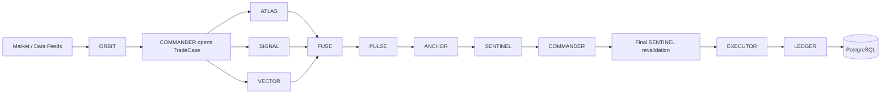

# Architecture

CryptoRoaster/rh-agents is a new, independent autonomous on-chain trading system. Phase 0 implements typed boundaries, deterministic paper trading, persistence, and a dashboard preview. Phase 1 adds provider-neutral market recording, public EVM ingestion, and a controlled realtime data runtime. Phase 2A adds the durable deterministic TradeCase workflow used by future team workers. No files or dependencies come from ClawfredAI/polma-db.

## Non-negotiable invariants

1. No individual LLM agent may sign or broadcast blockchain transactions.
2. Agents may autonomously request trades.
3. Human approval is not required per trade.
4. Every trade must pass the deterministic risk engine.
5. Risk rejection cannot be overridden by an agent.
6. Executor is the only future component allowed to access signing infrastructure.
7. Ledger/database is authoritative for positions and accounting.
8. UNKNOWN or unavailable safety-critical data must fail closed.
9. No live-money implementation during Phase 0.
10. All agent decisions and execution stages must be traceable.

## Pipeline and ownership

| Component | Responsibility | Implementation |
| --- | --- | --- |
| ORBIT | Discover opportunities | Agent contract / planned |
| ATLAS | On-chain, holders, wallets | Agent contract / planned |
| SIGNAL | Sentiment, social activity, hype versus demand | Agent contract / planned |
| VECTOR | Entry, invalidation, targets | Phase 2H worker; model-backed, disabled by default |
| PULSE | Entry and exit triggers | Agent contract / planned |
| ANCHOR | Liquidity, routes, impact, slippage | Agent contract / planned |
| SENTINEL | Unconditional hard risk limits | Deterministic Python service |
| FUSE | Combine validated information into proposals | Agent contract / planned |
| COMMANDER | Autonomous orchestration and lifecycle | Agent contract; trusted paper coordinator |
| LEDGER | Fills, cost basis, positions, PnL, reconciliation | Deterministic accounting; reconciliation planned |
| EXECUTOR | Simulate; later sign, send, confirm, reconcile | Infrastructure service; paper only |

The initial SENTINEL stage validates upstream information. A second check immediately before execution validates the **final** intent against the current portfolio; FUSE and COMMANDER cannot carry an earlier approval across changed terms. Phase 2A implements only the deterministic workflow and evidence boundary. LLM implementations and the autonomous scheduling loop remain future work.

## Phase 2A TradeCase workflow

`TradeCaseService` is the only normal mutation boundary for workflow state. It persists a frozen market-bound TradeCase, durable specialist tasks, immutable typed evidence, structured blockers, SENTINEL bindings, state transitions, and a sequence-ordered audit timeline. `TradeCaseEvaluator` derives state under the central versioned `trade-case-v1` policy; callers cannot set a status or override a blocker.

Safety-critical ATLAS, VECTOR, PULSE, and ANCHOR evidence fails closed when UNKNOWN, UNAVAILABLE, INVALID, or STALE. Freshness uses the trusted Clock. A trigger references the exact current VECTOR evidence, and ANCHOR references both setup and trigger. The risk-input digest binds SENTINEL to the active safety evidence; a changed or expired input invalidates an earlier authorization.

Phase 0 `RiskOutcome` is unchanged. One deterministic classifier, `RiskAuthorization`, is the single interpretation of a final SENTINEL decision: `APPROVED`, `LIMITED`, or `REJECTED`. `LIMITED` is reached only when a `REJECT` is exclusively a resizable sizing rejection carrying a strictly positive bounded capacity; `PAUSE_SYSTEM`, any non-sizing reason code, any unrecognised code, and any future outcome all fail closed to `REJECTED`. `RISK_APPROVED` and `RISK_LIMITED` are authorizations rather than endings and stay revalidatable, so changed safety evidence revokes them; only `RISK_REJECTED`, `EXPIRED`, and `CANCELLED` are terminal. Every deterministic limit a future execution boundary must honour is persisted in its own typed Decimal column.

PostgreSQL row locks serialize updates to one case. Unique idempotency and revision constraints reject conflicting replay, while append-only triggers protect evidence, risk bindings, transitions, and timeline events. Public `/api/trade-cases` routes are GET-only. Future workers receive typed submit capabilities rather than database, signer, executor, or force-transition access. See [Phase 2A workflow details](docs/phase-2a.md).

## Phase 2B worker capability runtime

`WorkerRuntimeService` is the only boundary through which a future specialist worker can affect authoritative state. Processing is at-least-once: a worker may repeat a task after a crash, a lost lease or an ambiguous acknowledgement, and duplicate execution produces no duplicate effect because a database-enforced single active lease, durable idempotency, immutable attempt history and idempotent evidence submission combine.

Workers are untrusted for authorization. They receive role-composed capabilities containing only permitted read ports and, for the six evidence roles, one write port already bound to their lease. No capability carries a database session, RPC or HTTP client, signer, wallet, executor, ledger write, SENTINEL mutation or status setter, and SENTINEL, LEDGER and EXECUTOR are absent from `AgentRole` entirely. Every submission is re-verified server-side regardless of which object the worker was handed.

Evidence recording, task completion and deterministic evaluation commit in one transaction, so a crash leaves neither a successful task without evidence nor evidence without completion. Leases expire, heartbeats extend only their own lease within a budget, bounded sweeps reclaim abandoned work, and typed failure categories drive deterministic bounded retries with durable backoff. Public `/api/workers` routes are GET-only; claim, heartbeat and completion stay internal. The runtime is disabled by default and no reasoning worker exists. See [Phase 2B worker runtime details](docs/phase-2b.md).

## Phase 2C ORBIT specialist worker

ORBIT is the first real specialist and the reference for every later LLM worker. It reasons over one purpose-built market view and produces typed `DISCOVERY_EVIDENCE`; it never says buy, sell, execute or approve, and its output schema cannot express a side, size, route or slippage allowance. A strong ORBIT opinion is not a risk authorization and bypasses nothing.

Reasoning happens behind a narrow provider-neutral port: typed input, typed output, bounded timeout, typed error categories, and no tool, network, filesystem or credential surface. A deterministic scripted provider drives every automated test; the Anthropic adapter is infrastructure, disabled by default, and its key is a `SecretStr` that never reaches a log, an API route or evidence. Phase 2B owns authoritative retries, so the adapter keeps only a single transport retry.

Model output is untrusted. Schema parsing proves the shape, then a semantic validator proves the content agrees with the input: invented observation references, the wrong market or chain, a value claimed for an unobserved measurement, or an absence claimed for an observed one are all invalid results that never become evidence. Instructions and market data travel in separate channels, so hostile token metadata stays quoted data. Zero and UNKNOWN remain different facts end to end, and money never passes through a float. Provenance records the input digest, prompt version and hash, provider and model — never a key, raw vendor response or chain-of-thought. Phase 2C adds no migration. See [Phase 2C ORBIT details](docs/phase-2c.md).

## Phase 2D ATLAS on-chain intelligence

ATLAS is the first safety-critical specialist, so fact, policy and interpretation are kept strictly apart. A deterministic collector establishes on-chain facts with per-domain availability and provenance; a versioned code-defined policy (`atlas-policy-v1`) computes the verdict — CLEAR, BLOCKED or INSUFFICIENT_DATA — from those facts alone; only then may a model add commentary. A failing, absent or over-confident model never changes the verdict, and the output schema has no verdict field for it to set.

This required one generic extension to Phase 2A. The evaluator previously asked only whether evidence was available, and the submission validator refused available on-chain evidence unless every domain passed — so a known-bad token could only have been recorded by disguising it as UNKNOWN. `EvidenceAcceptance` now sits alongside `EvidenceStatus` as a second axis derived deterministically from the typed payload, and one central `unusable_reason` check asks both questions. A measured violation is available evidence that blocks; an unobtainable fact is insufficient evidence that also blocks, for a different reason.

ATLAS receives `{lease, context, submit}` and no RPC, indexer, session, HTTP client, signer, wallet, executor or ledger write; the collector uses approved services internally. The RPC client gained three explicit read methods behind its allowlist, with no generic call path. Phase 2D shipped with no verified holder or creator provider, so both domains were UNAVAILABLE and ATLAS could not reach CLEAR — the intended fail-closed outcome rather than a gap to work around, and the blocker Phase 2E resolves. Phase 2D adds no migration. See [Phase 2D ATLAS details](docs/phase-2d.md).

## Phase 2E ATLAS data enablement

Phase 2E makes the required holder domain satisfiable by connecting verified sources rather than by relaxing policy. Robinhood Chain holders and contract creation come from the credentialed Blockscout PRO API; BNB Smart Chain holders come from Moralis and creation from Etherscan V2, because Blockscout does not index BSC. Routing is per chain and explicit — an unconfigured chain answers NOT_CONFIGURED and never borrows another chain's source, since address equality means nothing across chains.

Providers return raw rows and provenance, never a concentration: the denominator is on-chain `totalSupply()` at the pinned block, so a vendor percentage cannot move a safety metric. Rows are sorted and deduplicated by us, top-N shares are exact Decimals over uint256 integers, and we exclude nothing from the raw metric — pools, burns and the deployer all stay visible. What a provider removes upstream is recorded instead of assumed away: Blockscout filters the zero address out of its holder query, so that exclusion is declared on the fact, carried into the digest, and withholds the burn adjustment, whose total could otherwise only be a lower bound. Coverage is typed (`COMPLETE`, `TOP_N_ONLY`, `UNKNOWN`), kept separate from provider filtering, and `atlas-policy-v2` names the minimum facts the holder domain requires instead of trusting a status flag. Blockscout's descending holder order is proven from the endpoint's own ordering and keyset predicate, so a prefix is a global top-N; Moralis's rests on its documented `order` parameter, which is sent explicitly on every page.

Freshness stays anchored to source observation: Blockscout's indexer head block and its chain timestamp, read before the holder pages so provenance can only under-claim. Moralis names no block, no block hash and no indexer timestamp, so only the moment its response was received is available — a receipt, not an observation — and that weaker `RESPONSE_TIME` basis is recorded on the fact rather than disguised as parity. Policy accepts it deliberately for PAPER through a named field, and `docs/phase-2e.md` records the pre-live requirement that live execution must not rest on it. The concentration threshold remains disabled, so a holder PASS means the data-quality prerequisite was satisfied, not that the distribution was judged safe. Adapters are infrastructure: bounded in time, size and request count, allowlisted to one configured HTTPS origin, refusing redirects, and never handing a worker a client, URL or credential. Phase 2E adds no migration. See [Phase 2E data enablement details](docs/phase-2e.md).

## Phase 2F SIGNAL social attention

SIGNAL is the social specialist, and the first worker whose input is written by people who may want to be seen. Three layers stay strictly apart: normalized public observations, a deterministic quality and manipulation layer computed in code, and a model that interprets language. The middle layer exists because the third cannot be trusted with it — a model can be talked into describing a copy-paste campaign as a movement; a count of distinct authors cannot.

Sentiment, attention, organic breadth, manipulation concern, social demand indication and data quality are six separate axes, never one score. Positive language is not buying, a high post count is not many people, and a repost is an attention event rather than a second opinion — so breadth and concentration are measured over accounts that actually wrote something. Duplicate clustering normalizes Unicode, case, whitespace and URLs, because campaigns defeat naive deduplication by appending a unique referral link to identical text. Freshness anchors to the source's own publication time inside a versioned window; a post fetched an hour later is still as old as it was written, and a set entirely outside the window is STALE rather than quiet.

A ticker is not an identity, and neither is a provider's own identifier: user 123 on X and user 123 on Reddit are two people, so every count and concentration measure compares namespaced author keys rather than bare handles — merging them would shrink the apparent crowd and inflate its apparent concentration at once. Both strong bindings are re-checked rather than believed. An exact contract address must name this token on this chain, and a verified project link must come from a trusted project-identity mapping; no such mapping exists yet, so an adapter cannot award itself the project's voice. The policy structurally refuses to admit an ambiguous reference. The model's social demand indication is capped by the measured breadth of authorship, it may only cite posts it was actually shown, and its output schema has no field in which a side, a size or an approval could be expressed — so an injected instruction has nothing to aim at. `signal-quality-v1` and `signal-v1` are versioned; evidence stores metrics, hashes and identifiers rather than third-party post text.

SIGNAL remains required and not safety-critical, exactly as the workflow already said: an unusable social set leaves the requirement pending rather than blocking a case, and a negative reading stops nothing. Sentiment stays out of the risk digest, which is a statement about which digest rather than about when it stops mattering — it is a required pre-trigger prerequisite, so a reading that later goes stale returns the case to EVIDENCE_PENDING through the evaluator while leaving the risk binding itself untouched. Phase 2F adds no migration and starts no worker; Phase 2G below connects the first real source. See [Phase 2F SIGNAL details](docs/phase-2f.md).

## Phase 2G SIGNAL data enablement

Phase 2G gives SIGNAL real public Farcaster observations through Neynar, and changes nothing else: normalization, identity, binding, duplicate detection, concentration, quality policy, model input and validator are exactly as Phase 2F left them. The adapter supplies observations and no judgement.

Three provider knobs are deliberately off, each giving up recall to keep provenance. Search is `mode=literal` with `sort_type=desc_chron` rather than semantic or hybrid, because a relevance-ranked set is a sample someone else selected and would become a sentiment prior. No `viewer_fid`, because a viewer's mutes and blocks would decide what SIGNAL may see. No provider-side spam filtering and no use of the provider's user score, because SIGNAL exists to measure campaigns and a provider that removes them first removes the evidence. There is no x402 or payment path: the system has no wallet and gains none.

The hard part was chain identity. A 20-byte EVM address is chain-scoped — the same deployer and nonce reproduce it on every EVM chain — and Farcaster search is not chain-aware, so "we searched for our address, therefore this cast is about our token on our chain" is circular and forbidden. Chain context comes only from the cast's own content: an allowlisted explorer host compared in full, or a tiny closed alias set matched on whole words in prose with URLs stripped first, since anyone can register a domain that spells a chain's name. A word is not a claim — "not on BSC", "fake BSC contract" and "maybe BSC" all contain the alias and none of them says the address is there, so a textual alias counts only when exactly one supported chain is mentioned and that mention is affirmative. Ambiguity resolves to nothing in every direction, and explorer links are unaffected by negation because a link containing the address is structural evidence of chain rather than an opinion about it. An exact address with no trustworthy context becomes `CONTRACT_ADDRESS_UNSCOPED`: admitted, weak, and never silently attributed to the TradeCase's chain. `VERIFIED_PROJECT_LINK` stays closed — no embed or provider label can create one.

Identity uses the numeric FID rather than a rentable username, cast hashes are namespaced per source, the same cast found by several queries is one observation, and a recast count is attention rather than five hundred authors. Source timestamps drive freshness and every returned timestamp is re-validated, because a bounded query is not authority. Coverage is a bounded query-plan result set, never a sentiment census, and a stream the provider ended is typed apart from one a local budget stopped: a truncated collection raises a gap, can never be better than degraded, and is biased toward the newest casts because the ordering is chronological. The request budget follows the query plan that actually runs rather than a constant. The provider is disabled by default, a key alone selects nothing, there is no `fake` provider option and no synthetic fallback: if Neynar cannot answer, SIGNAL is unavailable and the case waits. Phase 2G adds no migration and starts no worker. See [Phase 2G SIGNAL data enablement](docs/phase-2g.md).

## Phase 2H VECTOR trade setup

VECTOR is the first specialist whose output describes an action: a side, an entry, the level at which the idea is wrong, ordered objectives and an expiry. It remains `TRADE_SETUP_EVIDENCE` and nothing more — PULSE watches the trigger, ANCHOR assesses execution conditions and SENTINEL decides risk, independently and in that order. There is no size, route, venue, slippage tolerance, approval or execution path anywhere in the phase, and the output schema has no field in which any of them could be expressed, so a compliant model has nowhere to put one.

Unlike SENTIMENT, TRADE_SETUP is safety-critical and sits in the canonical risk digest. That was audited rather than assumed, and it decides the supersession semantics: a second setup does not merely replace the first. The trigger that named the old setup stops matching, the execution assessment built on both stops being current, the digest changes, and any `RISK_APPROVED` or `RISK_LIMITED` authorization pinned to the old digest is revoked through the evaluator. The evidence envelope expires exactly when the setup does, so an expired proposal blocks as stale safety evidence rather than lingering as a live opinion.

The market layer records only the newest snapshot per stream, so there is no history, no candles and no trend features; a setup is drawn from one observed price and says so, because assembling a bar series from sparse snapshots would be a fabrication wearing the name of market data. Every level is USD per one base unit, declared once and carried on the setup, the trigger, the model document and the fingerprint. Two shapes exist — `BREAKOUT_LONG` on a single level with a `PRICE_GTE` trigger, `PULLBACK_LONG` on a band with `PRICE_IN_RANGE` — and the trigger is derived from the geometry rather than proposed beside it, so a setup cannot describe one thing and be watched for another. `Side` has no SHORT and the paper service is long-only, so a `SELL` proposal is refused rather than ignored.

Nothing is repaired. An invalidation above the entry is not reordered, unsorted targets are not sorted, an over-long expiry is not clamped and an out-of-envelope level is not pulled to the edge: each repair would invent a setup nobody proposed while the audit record still attributed it to the model. The proposal is refused with a safe reason code and the runtime retries. A missing, stale, mismatched or priceless market observation ends the attempt before any model call, and there is no fallback setup and no reissue of the previous one, because everything downstream reads a current setup as a current opinion. Identity is derived: the setup id is a UUID5 of a fingerprint over geometry, trigger, expiry, market and input digest, so identical proposals are one setup and a single moved level is another. Phase 2H adds one optional payload field, no migration and no worker start. See [Phase 2H VECTOR trade setup](docs/phase-2h.md).

## Typed asynchronous contracts

Pydantic contracts reject extra fields and nonfinite amounts. Records carry UUIDs, timezone-aware timestamps, source, and correlation IDs. Decisions use discriminated observation/setup/intent payloads. SENTINEL, LEDGER, and EXECUTOR are deliberately excluded from the LLM role enum. FUSE and COMMANDER may propose intents; proposal traces must match.

`DecisionBus` is a bounded asyncio queue with backpressure and acknowledgment. It is ephemeral transport, never authoritative state. `data.repository.append` prepares persistence for typed agent decisions. Phase 1 must persist decisions before publishing and add durable delivery/replay.

## Risk and execution boundary

SENTINEL checks mode, time, asset identity, token/routing/holder/accounting status, holder concentration, liquidity, known fees/slippage, cash, holdings, position size, exposure, daily losses, and kill switch. Only PASS safety statuses are accepted. Missing marks for any open position reject new execution. BUY sizing includes worst permitted slippage and fees; SELL cannot exceed recorded holdings. Daily loss conservatively combines gross realized losses since UTC midnight with current unrealized losses; winning trades do not restore that budget. Kill switch and daily loss breaches return PAUSE_SYSTEM and latch the database pause.

Approvals bind intent and market fingerprints, trace, limits, and a short validity interval. Changed orders or snapshots cannot reuse approval. Fingerprints provide content binding, **not authentication**: the coordinator, policy, feed adapters, and database are trusted infrastructure. Agents must never receive access to these objects, database writes, or executor calls. The read-only API exposes no order submission or policy mutation endpoint.

Risk decisions separate the absolute `position_size_limit_usd` from `max_additional_notional_usd`, which is additional BUY quote notional before costs. For BUY, the cost budget is `max(0, min(cash, exposure_limit - exposure, position_limit - held_quantity * quote_price))`. Divide that budget by `(1 + permitted_slippage_bps / 10000) * (1 + fee_bps / 10000)`, round down to 18 decimal places, and reduce further if intermediate cost rounding would exceed the budget. SELL always reports zero additional BUY guidance. Unknown inputs, pauses, and other non-sizing rejection reasons also force zero. Sizing-only rejection may report a smaller capacity. The final intent still independently passes all SENTINEL checks; guidance cannot be used as approval. Legacy risk payloads retain their absolute limit and read with zero incremental capacity, preserving durable replay without rewriting event history.

The trusted coordinator owns an injected `Clock`, with `SystemClock` as the runtime default and `FixedClock` for deterministic tests. Trading requests cannot supply runtime time. Freshness checks and UTC loss-day accounting use time sampled after acquiring the portfolio lock and loading positions. Execution request time is sampled again so expired approval rolls back the transaction. Clock selection belongs exclusively to trusted service construction; agents have no access to clock injection or mutation.

`PaperExecutor` is pure simulation over an approved snapshot: adverse slippage raises BUY price and lowers SELL price; fees are charged on filled notional. It makes no network calls and has no signer. Identical order/data inputs yield identical execution IDs and results. Gas and modeled execution latency are zero; transaction timestamps remain null. This is a deterministic arithmetic model, not an AMM or mempool simulator.

## Authoritative persistence and accounting

PostgreSQL holds market snapshots, agent/risk decisions, trade/order intents, executions, positions, trades, PnL, and one paper account initialized to $10,000 of fictitious cash. Typed immutable event payloads use versioned JSONB with indexed metadata and relational foreign keys. Positions and account balances use NUMERIC(38,18); no JSON files store state.

`PaperTradingService` opens a separate AsyncSession per call and locks the singleton account row. It evaluates risk and commits order, fill, position, cash, trade, and PnL in one transaction. Unique intent/order/execution constraints plus persisted replay results provide idempotency across restarts and concurrent calls. Same ID with changed content is an error; rejected IDs replay their rejection. A fresh attempt requires a fresh intent ID. Execution exceptions roll back the entire transaction and emit an error log with correlation and intent IDs; durable failed-attempt storage remains Phase 1 work.

Scope is one USD-quoted, long-only spot paper portfolio. Asset IDs must be chain-qualified. Weighted average cost includes BUY fees. SELL fees reduce proceeds; partial sells remove proportional cost basis. Unrealized PnL is marked value minus remaining basis. Realized plus unrealized PnL equals equity less initial cash when there are no external deposits. Accounting rounds to 18 decimal places at storage boundaries. No shorts, leverage, funding, or tax-lot accounting.

## Runtime and deployment

PostgreSQL is a native external service, managed independently of the application, and remains the authoritative production database. Local development targets macOS with native Python and Node.js; the setup guide includes an optional Homebrew PostgreSQL installation example. Runtime Settings require a `postgresql+asyncpg://` `DATABASE_URL` with a database name, including native Unix-socket URLs. Missing, blank, malformed, SQLite, and unsupported-driver URLs are rejected. Application code has no default database URL or Homebrew path assumptions. SQLite test engines are constructed directly, outside runtime Settings. The backend and Alembic read the root `.env` when run from `backend/`; migrations run directly against the configured PostgreSQL instance. SQLite is retained only as an optional lightweight test backend and cannot validate PostgreSQL row locking.

Development and deployment use native host processes exclusively. The production target is a Linux VPS running native PostgreSQL, the Python backend, and the Next.js frontend as separate services. Later systemd units may supervise the application processes. Phase 0 behavior and paper-only execution boundaries apply on every host.

## Observability and dashboard

Contracts reserve `detected_at`, `decision_at`, `risk_approved_at`, `execution_requested_at`, `tx_signed_at`, `tx_sent_at`, and `tx_confirmed_at`. Fills include signal, quote, and execution prices; estimated/realized slippage in basis points; fees/gas in USD; and execution latency in milliseconds. Correlation indexes connect decisions to results and accounting.

The light Next.js dashboard uses labeled static fixtures. Mode selection changes presentation only. LIVE AUTONOMOUS and operational controls are disabled; the frontend does not connect to the ledger yet. Agent cards report planned or paper-ready components, never claim running agents. Native semantic controls suffice for this shell; add shadcn/ui when richer interaction primitives are needed.

## Phase 1A market recording

The implemented path is **Market Provider -> normalization -> MarketRecorder -> PostgreSQL -> ORBIT input**. Provider-specific adapters implement discovery, snapshot and price/liquidity/volume protocols in `src/markets/providers.py`. Agents receive no raw HTTP/RPC clients. The in-memory adapter is explicitly fixture-only. Phase 1B adds GeckoTerminal; no LLM is included.

Immutable ingestion contracts in `src/markets/models.py` carry event UUIDs, provider, observation time, chain/network-qualified asset and pair identities, correlation UUIDs and fixture markers. Decimal values retain exact precision; UNKNOWN/unavailable values remain null. Discovery-to-snapshot binding compares an immutable `MarketIdentity` containing provider, chain, network, pair_id, base.asset_id, quote.asset_id, venue and is_fixture. Discovery event IDs, timestamps and correlation IDs may differ from later snapshot metadata; nested provenance validation remains enforced within each observation. These models are distinct from SENTINEL execution evidence: recorded data cannot authorize a trade or imply missing safety checks passed.

Migration `0002` stores versioned normalized snapshot envelopes in PostgreSQL JSONB, indexed by provider/pair/time and asset/time. Atomic insert-on-conflict plus payload comparison provides concurrent idempotency and rejects conflicting identities. A PostgreSQL trigger rejects UPDATE, DELETE and TRUNCATE. The recorder owns no strategy or executor capability and does not lock portfolio accounting rows.

The read view ranks complete provider/pair/fixture streams by **observed_at DESC -> recorded_at DESC -> UUID deterministic fallback** (`id DESC`). Trusted recorded_at resolves equal observation timestamps; UUID is only the final tie breaker. Replay keeps the original recorded_at. Only after selecting the newest stream event are visibility, identity, provider, chain/network, availability and trusted-clock freshness filters applied. Newer invalid or identity-inconsistent events therefore never expose older matching evidence. Provider and fixture streams remain isolated. Candidate references derive from valid snapshots without ranking opportunities. `OrbitMarketInput` exposes only latest snapshots and candidates. The API adds only GET market/candidate routes and requires migration `0003` for readiness. Fixtures are hidden by default. Future agents must consume serialized records through an isolated read-only boundary, never DB sessions, provider clients, recorder or executor objects. Provider credentials, when needed, belong in Settings/environment.

See [docs/phase-1.md](docs/phase-1.md) for exact freshness semantics, API filters, persistence guarantees, fixture execution and remaining throughput/deployment work. PAPER remains the only trading-capable mode.

## Phase 1B EVM provider boundary

**GeckoTerminal -> EVM chain mapping -> Decimal-safe transport -> provider DTO -> canonical MarketPair/MarketSnapshot -> MarketRecorder -> PostgreSQL -> ORBIT read boundary**.

One `GeckoTerminalAdapter` handles both supported targets through immutable chain configuration: `robinhood/mainnet` means chain_id 4663; `bsc/mainnet` means chain_id 56. Chain IDs belong to that registry; canonical records retain existing chain/network fields rather than duplicating registry state. Provider IDs are independent Settings values. A pass-scoped NetworkDirectory verifies ID and CoinGecko asset-platform association against `/networks`: `robinhood` / `robinhood`, and `bsc` / `binance-smart-chain`. The provider's network list is not an RPC chain-ID attestation. A missing or mismatched entry rejects; a bounded incomplete scan reports budget exhaustion, never substitutes a network.

The transport pins public API V2 `Accept: application/json;version=20230203` and a project User-Agent. No credential is needed or sent. httpx uses finite connect/read/whole-request timeouts, bounded retries and Retry-After, a concurrency semaphore, and shared logical-request/HTTP-attempt budgets. Redirects and environment proxy inheritance are disabled. Decimal-safe JSON parsing rejects duplicate keys, nonfinite constants and malformed numbers. Typed safe errors do not contain upstream response bodies or transport diagnostics.

A network's first new-pools page requests included base/quote tokens and DEX data. Pool attributes provide base_token_price_usd, reserve_in_usd and volume_usd.h24 directly. Addresses come from explicit pool/token attributes, never by inventing an address from a JSON:API relationship ID. Resource IDs are cross-checked against the configured provider network and actual address. Token relationships must resolve to the correctly typed included resources. Canonical token addresses are lowercase nonzero 40-digit hex strings; base and quote must differ. Pool locators explicitly distinguish 20-byte CONTRACT_ADDRESS from 32-byte BYTES32_POOL_ID; both require nonzero hexadecimal values. Venue is the provider DEX relationship ID. No aggregate token values, unrelated metrics or creation timestamps are promoted into pool measurements.

Successful fetch-completion Clock time becomes observed_at. This is local retrieval provenance, not proof of underlying provider freshness; public endpoint caching can delay data. Every normalized event has its own UUID and correlation trace. The adapter's pass-scoped snapshot lookup preserves the exact discovered event for recording/replay; it clears on rediscovery, including failure. It is not authoritative state. Recorder insertion assigns independent recorded_at. `record_pair` shares the existing identity/provenance checks with `record_provider`; append-only storage and **observed_at DESC -> recorded_at DESC -> UUID deterministic fallback**, with rank-before-filter, remain unchanged.

Default bounds: 3 network pages + 2 chain pages = at most 5 logical requests; retries cannot exceed 8 HTTP attempts for the entire pass. Up to 3 pools per chain are inspected, with no detail lookups. The one-shot service is sequential and the transport defaults to concurrency 1. Malformed individual pools count as failures; conflicting duplicate resources abort the chain before recording its batch. Provider-wide outages abort remaining work; unsupported chain mapping alone allows the other chain to proceed. Existing committed observations remain durable and partial counts are reported safely.

PostgreSQL remains authoritative. No new schema, trading behavior or agent DB privileges are introduced. ORBIT receives only the existing read boundary, never DTOs, transports, sessions or write credentials. **Market observation != SENTINEL approval evidence.** No LLM, wallet, private-key, signing, transaction or live-execution feature is added. No Docker/container workflow, Solana or Birdeye integration is present in this phase. RPC/WebSocket watchers are deferred to Phase 1C.

## Later Phase 1 boundaries

Add independent secondary read-only feed adapters, provider-authenticated evidence, asynchronous agent runners, durable messages, scheduling, lifecycle state machines, database-backed dashboard queries, trace export, failed-attempt records, reconciliation, and operational policy management with authenticated access. Test feed freshness and liquidity-dependent price impact before expanding execution scope. Live execution, signing infrastructure, transaction recovery, and deployment security require a separate future phase.

## Explicit pool locators and exact market precision

EVM token identity remains a nonzero 20-byte address. A market can instead identify a standalone pool contract or a logical singleton pool. Immutable `PoolLocator` contains `kind` (`CONTRACT_ADDRESS` or `BYTES32_POOL_ID`), lowercase hex `value`, normalized `venue`, optional `pool_manager_address`, and explicit `manager_status` (UNKNOWN by default). Values require exactly 20 or 32 bytes according to kind; malformed hex and zero values reject. A bytes32 pool ID is not a wallet or contract address. JSON:API IDs only cross-check provider bindings; actual locators come from pool attributes.

Canonical contract pool IDs are `<chain>:<network>:contract_address:<value>`. Singleton IDs are `<chain>:<network>:bytes32_pool_id:<venue>:<value>`. MarketIdentity binds only PoolLocatorIdentity (kind, value, venue), provider, chain/network, base/quote assets and fixture marker. Manager address/status are enrichable routing metadata on the observation’s pair.pool_locator, excluded from pair_id and MarketIdentity equality. UNKNOWN to known (AVAILABLE in the existing availability enum) preserves both identities and the same provider/pair/fixture stream. Enrichment is a new append-only event; changing metadata under an existing event UUID still conflicts. Different venues cannot collapse the same bytes32 value. No PoolManager is inferred from a DEX name. Within one canonical chain/network/stable venue namespace, a bytes32 pool ID is the stable logical pool identifier. If independent PoolManagers later prove to have colliding IDs under that namespace, an explicit future deployment namespace/resolution model is required. Manager discovery must never mutate identity. Existing normalized venue identifiers remain stable (for example uniswap-v4-bsc and uniswap-v4-robinhood); manager knowledge never renames their namespace. Later PULSE/ANCHOR/execution would require venue-specific resolution and the relevant PoolManager/router, outside Phase 1B.

Migration `0003` widens indexed pair_id to VARCHAR(512) and permits schema versions 1 and 2. Migration `0002` is unchanged. New provider snapshots use version 2 and require a locator. Legacy version-1 observations remain readable and replayable without adding a locator key to their persisted payload or guessing their type. Downgrade to 0002 preserves compatible history and explicitly refuses incompatible version-2/long-ID rows; it never deletes or rewrites observations. Append-only triggers, concurrent idempotency and observed_at DESC -> recorded_at DESC -> id DESC rank-before-filter semantics remain intact.

Market measurements use PostgreSQL **JSONB containing exact Decimal strings**, not a fixed-scale NUMERIC column. API output also uses strings. Removing the market model's former 18-place restriction therefore requires no numeric column conversion. Accounting NUMERIC(38,18) and SENTINEL contracts remain unchanged. Market bounds allow at most 100 coefficient digits (including trailing zeros), with both Decimal tuple exponent and adjusted exponent within [-1000, 1000]. Finite nonnegative values are preserved without quantization or binary floats; available prices must remain positive.

JSON null and absent measurements both become UNKNOWN with value null. Numeric zero and string "0" become AVAILABLE Decimal("0") for liquidity/volume. Price zero remains UNKNOWN because a usable canonical price must be positive. Tests cover these distinctions and 19-place, 30-plus-place and scientific-notation prices through transport, DTOs, PostgreSQL, MarketReader and API. No observation constitutes SENTINEL approval evidence.

### One-shot operational counters

The summary prints `discovered`, `recorded`, `readable`, `unavailable`, `rejected`, `failed`, sorted safe `reasons`, and an optional pass-level `error`. Discovered counts inspected entries after recognized duplicate removal, within the configured bound. Recorded counts durable accepted writes/replays. After recording, each event is checked through the existing MarketReader boundary: readable counts that exact event still visible; unavailable counts successful writes hidden by availability/freshness/latest-event rules. Unavailable is not a provider or persistence failure. Readback errors leave the write counted as recorded and increment failed with `readback_failed`; they do not claim a successful visibility check.

Rejected counts isolated malformed provider entries. Failed includes rejected entries plus pass-level provider/recording/readback failures; it is not the number of unavailable observations. `reasons` groups fixed safe error codes (for example provider_identity or provider_contract), never payloads or exception text. A provider-wide or persistence failure can abort remaining work, so discovered need not equal recorded + rejected. The CLI returns nonzero for failures, including partial rejected results; successful unavailable observations alone do not cause a failure exit. Public request bounds remain unchanged.

## Phase 1C: controlled runtime infrastructure

GeckoTerminal → bounded scheduled MarketWatcher → unchanged MarketRecorder → PostgreSQL → MarketReader / ORBIT read boundary.

Managed Robinhood/BSC RPC/WSS → independent chain-ID verification → bounded notifications → confirmed HTTP gap recovery → separate EVM observations, cursors and audit history in PostgreSQL. These are separate source/provenance paths; raw logs are never MarketSnapshots or automatic SENTINEL evidence.

Migration 0004 introduces append-only runtime/log history and transactionally locked cursor projections. Session advisory ownership protects the watcher and each chain worker across processes. Confirmation lag, bounded recovery, reorg rewind auditing, backpressure and stale health are described in [Phase 1C](docs/phase-1c.md). Future agents consume controlled readers/evidence services, never arbitrary RPC clients or database write credentials. Existing PoolLocator identities, market precision, SENTINEL and paper accounting remain unchanged.
