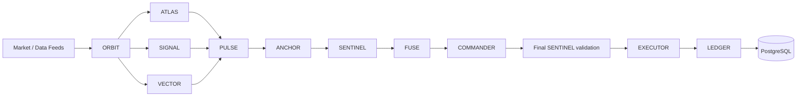

# Architecture

CryptoRoaster/rh-agents is a new, independent autonomous on-chain trading system. Phase 0 implements typed boundaries, deterministic paper trading, persistence, and a dashboard preview. Phase 1A adds provider-neutral market observation recording and read paths, with no live-money execution. No files or dependencies come from ClawfredAI/polma-db.

## Non-negotiable invariants

1. No individual LLM agent may sign or broadcast blockchain transactions.
2. Agents may autonomously request trades.
3. Human approval is not required per trade.
4. Every trade must pass the deterministic risk engine.
5. Risk rejection cannot be overridden by an agent.
6. Executor is the only future component allowed to access signing infrastructure.
7. Ledger/database is authoritative for positions and accounting.
8. UNKNOWN or unavailable safety-critical data must fail closed.
9. No live-money implementation during Phase 0.
10. All agent decisions and execution stages must be traceable.

## Pipeline and ownership

| Component | Responsibility | Implementation |
| --- | --- | --- |
| ORBIT | Discover opportunities | Agent contract / planned |
| ATLAS | On-chain, holders, wallets | Agent contract / planned |
| SIGNAL | Sentiment, social activity, hype versus demand | Agent contract / planned |
| VECTOR | Entry, invalidation, targets | Agent contract / planned |
| PULSE | Entry and exit triggers | Agent contract / planned |
| ANCHOR | Liquidity, routes, impact, slippage | Agent contract / planned |
| SENTINEL | Unconditional hard risk limits | Deterministic Python service |
| FUSE | Combine validated information into proposals | Agent contract / planned |
| COMMANDER | Autonomous orchestration and lifecycle | Agent contract; trusted paper coordinator |
| LEDGER | Fills, cost basis, positions, PnL, reconciliation | Deterministic accounting; reconciliation planned |
| EXECUTOR | Simulate; later sign, send, confirm, reconcile | Infrastructure service; paper only |

The initial SENTINEL stage validates upstream information. A second check immediately before execution validates the **final** intent against the current portfolio; FUSE and COMMANDER cannot carry an earlier approval across changed terms. LLM implementations and the autonomous scheduling loop are Phase 1 work.

## Typed asynchronous contracts

Pydantic contracts reject extra fields and nonfinite amounts. Records carry UUIDs, timezone-aware timestamps, source, and correlation IDs. Decisions use discriminated observation/setup/intent payloads. SENTINEL, LEDGER, and EXECUTOR are deliberately excluded from the LLM role enum. FUSE and COMMANDER may propose intents; proposal traces must match.

`DecisionBus` is a bounded asyncio queue with backpressure and acknowledgment. It is ephemeral transport, never authoritative state. `data.repository.append` prepares persistence for typed agent decisions. Phase 1 must persist decisions before publishing and add durable delivery/replay.

## Risk and execution boundary

SENTINEL checks mode, time, asset identity, token/routing/holder/accounting status, holder concentration, liquidity, known fees/slippage, cash, holdings, position size, exposure, daily losses, and kill switch. Only PASS safety statuses are accepted. Missing marks for any open position reject new execution. BUY sizing includes worst permitted slippage and fees; SELL cannot exceed recorded holdings. Daily loss conservatively combines gross realized losses since UTC midnight with current unrealized losses; winning trades do not restore that budget. Kill switch and daily loss breaches return PAUSE_SYSTEM and latch the database pause.

Approvals bind intent and market fingerprints, trace, limits, and a short validity interval. Changed orders or snapshots cannot reuse approval. Fingerprints provide content binding, **not authentication**: the coordinator, policy, feed adapters, and database are trusted infrastructure. Agents must never receive access to these objects, database writes, or executor calls. The read-only API exposes no order submission or policy mutation endpoint.

Risk decisions separate the absolute `position_size_limit_usd` from `max_additional_notional_usd`, which is additional BUY quote notional before costs. For BUY, the cost budget is `max(0, min(cash, exposure_limit - exposure, position_limit - held_quantity * quote_price))`. Divide that budget by `(1 + permitted_slippage_bps / 10000) * (1 + fee_bps / 10000)`, round down to 18 decimal places, and reduce further if intermediate cost rounding would exceed the budget. SELL always reports zero additional BUY guidance. Unknown inputs, pauses, and other non-sizing rejection reasons also force zero. Sizing-only rejection may report a smaller capacity. The final intent still independently passes all SENTINEL checks; guidance cannot be used as approval. Legacy risk payloads retain their absolute limit and read with zero incremental capacity, preserving durable replay without rewriting event history.

The trusted coordinator owns an injected `Clock`, with `SystemClock` as the runtime default and `FixedClock` for deterministic tests. Trading requests cannot supply runtime time. Freshness checks and UTC loss-day accounting use time sampled after acquiring the portfolio lock and loading positions. Execution request time is sampled again so expired approval rolls back the transaction. Clock selection belongs exclusively to trusted service construction; agents have no access to clock injection or mutation.

`PaperExecutor` is pure simulation over an approved snapshot: adverse slippage raises BUY price and lowers SELL price; fees are charged on filled notional. It makes no network calls and has no signer. Identical order/data inputs yield identical execution IDs and results. Gas and modeled execution latency are zero; transaction timestamps remain null. This is a deterministic arithmetic model, not an AMM or mempool simulator.

## Authoritative persistence and accounting

PostgreSQL holds market snapshots, agent/risk decisions, trade/order intents, executions, positions, trades, PnL, and one paper account initialized to $10,000 of fictitious cash. Typed immutable event payloads use versioned JSONB with indexed metadata and relational foreign keys. Positions and account balances use NUMERIC(38,18); no JSON files store state.

`PaperTradingService` opens a separate AsyncSession per call and locks the singleton account row. It evaluates risk and commits order, fill, position, cash, trade, and PnL in one transaction. Unique intent/order/execution constraints plus persisted replay results provide idempotency across restarts and concurrent calls. Same ID with changed content is an error; rejected IDs replay their rejection. A fresh attempt requires a fresh intent ID. Execution exceptions roll back the entire transaction and emit an error log with correlation and intent IDs; durable failed-attempt storage remains Phase 1 work.

Scope is one USD-quoted, long-only spot paper portfolio. Asset IDs must be chain-qualified. Weighted average cost includes BUY fees. SELL fees reduce proceeds; partial sells remove proportional cost basis. Unrealized PnL is marked value minus remaining basis. Realized plus unrealized PnL equals equity less initial cash when there are no external deposits. Accounting rounds to 18 decimal places at storage boundaries. No shorts, leverage, funding, or tax-lot accounting.

## Runtime and deployment

PostgreSQL is a native external service, managed independently of the application, and remains the authoritative production database. Local development targets macOS with native Python and Node.js; the setup guide includes an optional Homebrew PostgreSQL installation example. Runtime Settings require a `postgresql+asyncpg://` `DATABASE_URL` with a database name, including native Unix-socket URLs. Missing, blank, malformed, SQLite, and unsupported-driver URLs are rejected. Application code has no default database URL or Homebrew path assumptions. SQLite test engines are constructed directly, outside runtime Settings. The backend and Alembic read the root `.env` when run from `backend/`; migrations run directly against the configured PostgreSQL instance. SQLite is retained only as an optional lightweight test backend and cannot validate PostgreSQL row locking.

Development and deployment use native host processes exclusively. The production target is a Linux VPS running native PostgreSQL, the Python backend, and the Next.js frontend as separate services. Later systemd units may supervise the application processes. Phase 0 behavior and paper-only execution boundaries apply on every host.

## Observability and dashboard

Contracts reserve `detected_at`, `decision_at`, `risk_approved_at`, `execution_requested_at`, `tx_signed_at`, `tx_sent_at`, and `tx_confirmed_at`. Fills include signal, quote, and execution prices; estimated/realized slippage in basis points; fees/gas in USD; and execution latency in milliseconds. Correlation indexes connect decisions to results and accounting.

The light Next.js dashboard uses labeled static fixtures. Mode selection changes presentation only. LIVE AUTONOMOUS and operational controls are disabled; the frontend does not connect to the ledger yet. Agent cards report planned or paper-ready components, never claim running agents. Native semantic controls suffice for this shell; add shadcn/ui when richer interaction primitives are needed.

## Phase 1A market recording

The implemented path is **Market Provider -> normalization -> MarketRecorder -> PostgreSQL -> ORBIT input**. Provider-specific adapters implement discovery, snapshot and price/liquidity/volume protocols in `src/markets/providers.py`. Agents receive no raw HTTP/RPC clients. The bundled in-memory adapter is explicitly fixture-only; no external provider integration or LLM is included.

Immutable ingestion contracts in `src/markets/models.py` carry event UUIDs, provider, observation time, chain/network-qualified asset and pair identities, correlation UUIDs and fixture markers. Decimal values retain exact precision; UNKNOWN/unavailable values remain null. Discovery-to-snapshot binding compares an immutable `MarketIdentity` containing provider, chain, network, pair_id, base.asset_id, quote.asset_id, venue and is_fixture. Discovery event IDs, timestamps and correlation IDs may differ from later snapshot metadata; nested provenance validation remains enforced within each observation. These models are distinct from SENTINEL execution evidence: recorded data cannot authorize a trade or imply missing safety checks passed.

Migration `0002` stores versioned normalized snapshot envelopes in PostgreSQL JSONB, indexed by provider/pair/time and asset/time. Atomic insert-on-conflict plus payload comparison provides concurrent idempotency and rejects conflicting identities. A PostgreSQL trigger rejects UPDATE, DELETE and TRUNCATE. The recorder owns no strategy or executor capability and does not lock portfolio accounting rows.

The read view ranks complete provider/pair/fixture streams by **observed_at DESC -> recorded_at DESC -> UUID deterministic fallback** (`id DESC`). Trusted recorded_at resolves equal observation timestamps; UUID is only the final tie breaker. Replay keeps the original recorded_at. Only after selecting the newest stream event are visibility, identity, provider, chain/network, availability and trusted-clock freshness filters applied. Newer invalid or identity-inconsistent events therefore never expose older matching evidence. Provider and fixture streams remain isolated. Candidate references derive from valid snapshots without ranking opportunities. `OrbitMarketInput` exposes only latest snapshots and candidates. The API adds only GET market/candidate routes and requires migration `0002` for readiness. Fixtures are hidden by default. Future agents must consume serialized records through an isolated read-only boundary, never DB sessions, provider clients, recorder or executor objects. Provider credentials, when needed, belong in Settings/environment.

See [docs/phase-1.md](docs/phase-1.md) for exact freshness semantics, API filters, persistence guarantees, fixture execution and remaining throughput/deployment work. PAPER remains the only trading-capable mode.

## Later Phase 1 boundaries

Add real read-only feed adapters, provider-authenticated evidence, asynchronous agent runners, durable messages, scheduling, lifecycle state machines, database-backed dashboard queries, trace export, failed-attempt records, reconciliation, and operational policy management with authenticated access. Test feed freshness and liquidity-dependent price impact before expanding execution scope. Live execution, signing infrastructure, transaction recovery, and deployment security require a separate future phase.
