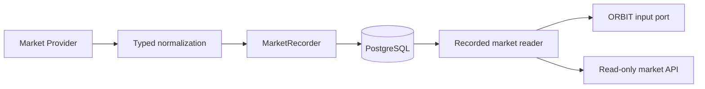

# Phase 1 — Market Recorder and EVM market data

## Scope and boundaries

Phase 1A implements a real PostgreSQL recording and read path for normalized market observations. Phase 1B adds GeckoTerminal public REST alongside the deterministic in-memory fixture adapter. No RPC transport, scheduler, LLM or trading strategy is implemented here. There is no live-money execution. PAPER remains the only trading-capable mode; all existing SENTINEL checks and paper accounting are unchanged.



`src/markets/providers.py` defines discovery, snapshot retrieval, and price/liquidity/volume protocols. Provider-specific transport and normalization belong behind these ports, outside agents. `record_provider` performs one explicit discovery/retrieval/recording pass. It validates both discovery and snapshot provenance against the adapter's declared provider and fixture status. Discovery and returned snapshots must have the same immutable `MarketIdentity`: provider, chain, network, pair_id, base.asset_id, quote.asset_id, venue and is_fixture. Event UUIDs, observed_at and correlation IDs may legitimately differ between discovery metadata and a later snapshot. Nested provenance checks remain mandatory within each record. The recorder also accepts already normalized snapshots from trusted infrastructure.

Future adapters must parse monetary JSON numbers as Decimal at the transport boundary (for example, `json.loads(body, parse_float=Decimal)`) or accept decimal strings. They must supply stable event UUIDs for upstream replay, such as UUIDv5 derived from provider, chain, network, pair and upstream observation identity. Reusing an event UUID with changed content is an error. Generating a fresh UUID for every retry defeats deduplication. Public GeckoTerminal requires no credentials. Prepared future secrets are neither required nor wired into this phase.

## Contracts and provenance

`src/markets/models.py` contains immutable `AssetIdentity`, `MarketPair`, `MarketSnapshot`, `PriceSnapshot`, `LiquiditySnapshot`, `VolumeSnapshot`, and `MarketCandidate` records. Each carries an observation UUID, timezone-aware `observed_at`, provider, chain, network, chain-qualified asset identity, correlation UUID, and explicit fixture marker. Pair identifiers use the same `chain:network:identifier` convention. A snapshot contains its pair/base/quote identities and price, liquidity and volume observations. Nested provider, chain/network, trace, fixture and asset identities must agree; quote assets are deliberately different from base assets. Nested observation timestamps cannot exceed their enclosing observation timestamp.

These ingestion models intentionally remain separate from the pre-existing `src/core/models.py` SENTINEL evidence models. Recorded price and liquidity data alone cannot prove token safety, routing safety, holder concentration, or accounting state. There is no automatic conversion into execution evidence and no route from the recorder to the executor.

Amounts use finite nonnegative Decimal values with at most 100 coefficient digits and tuple/adjusted exponent magnitudes at most 1000; available prices must be positive. Floats and booleans are rejected, including in nested fields. JSON encodes decimals as strings to retain exact precision. Every measurement exposes `AVAILABLE`, `UNKNOWN`, or `UNAVAILABLE`; absent values remain null. `AVAILABLE` requires a value, and the other statuses require null. Zero is only valid when explicitly observed, never a substitute for missing data.

## Persistence and replay

Alembic revision `0002` adds `market_observations`, separate from the trading-evidence table `market_snapshots`. Every row holds one normalized snapshot envelope with all component observations, schema version 1 (legacy) or 2 (explicit pool locator), provider and chain-qualified identity, event/trace UUIDs, provider observation time, trusted recording time, freshness metadata and JSONB payload. The payload contains normalized observations, not arbitrary provider response bodies. PostgreSQL is authoritative; no runtime file store is used.

A primary key on the event UUID plus `INSERT ... ON CONFLICT DO NOTHING` serializes duplicate ingestion. The recorder compares the existing normalized serialized payload within the transaction: identical replay succeeds without another row; different content or provenance raises `ObservationConflict`. Serialization preserves decimal scale and timestamp representation, so adapters must normalize these consistently across retries. Trusted recorded_at is assigned only to the first insertion; replay retains it and cannot promote an older event in the read ordering. Unrelated events do not lock the paper portfolio account.

The migration adds a PostgreSQL trigger rejecting UPDATE, DELETE and TRUNCATE. It protects against accidental mutations; database owners can still alter schema/disable triggers. Runtime identities must not be schema owners in a hardened deployment. Migration downgrade deliberately drops this table and its history; use it only on disposable databases or after an explicit backup/recovery decision.

Indexes cover provider/pair/time/event ordering, asset/time lookup and observation time. Records are appended without updating portfolio rows or maintaining expensive aggregates. Reads use a window query and bounded results, not an in-memory scan of all JSON payloads. Retention, partitioning, write batching, connection capacity and query plans require measurement at actual provider volume; no additional infrastructure or throughput claim is introduced.

## Latest data and freshness

The reader first ranks each complete provider/pair/fixture stream by **observed_at DESC -> recorded_at DESC -> UUID deterministic fallback** (`id DESC`). Provider observation time takes precedence; for equal observation times, trusted recorder time determines recency. UUID only resolves ties in both timestamps and never substitutes for recorder recency. After newest-event selection, visibility, identity, provider, chain/network, availability and freshness filters are applied. New UNKNOWN, unavailable, future-dated, stale-component or identity-inconsistent events cannot reveal an older matching event from the same stream. In particular, filtering for an old base asset never resurrects an earlier event after the latest event changes that identity. Provider and fixture streams remain isolated.

Freshness uses a trusted Clock at query time and is rechecked after the database read. `MARKET_MAX_AGE_SECONDS` defaults to 60 (allowed range 1–3600) for API reads. The snapshot envelope plus price, liquidity and volume timestamps must be within that interval and not in the future. Static asset/pair identity metadata may be older. Price and liquidity must be available; volume may be explicitly unknown. This means “usable recorded data,” never “safe to trade.” Known zero liquidity is still an observation, not a trading endorsement.

Old, future-dated and unknown observations remain durably recorded for audit but are not returned as valid current snapshots. `MarketCandidate` is a deterministic reference to a valid recorded snapshot with preserved provenance. It contains no opportunity score, recommendation or tradability assertion. Candidate references are derived at read time; the underlying snapshot is authoritative.

Fixtures are excluded by default. Explicit `include_fixtures=true` includes labeled fixture streams. An invalid latest fixture cannot suppress a non-fixture stream. `MarketRecorder.latest` exposes the default 60-second view; construct `MarketReader(max_age=...)` for a different trusted internal threshold.

## API and ORBIT

- `GET /api/markets`: latest valid snapshots; optional provider, chain, network and fixture filters.
- `GET /api/markets/{identity}`: exact chain-qualified asset or pair; the newest valid result across matching streams, or 404. The list endpoint exposes provider-specific results when several streams match.
- `GET /api/market-candidates`: candidate references derived from the same valid snapshot view.

Lists accept `limit` (1–100, default 50) and nonnegative `offset`; ordering is observed_at, recorded_at, then event UUID, all descending. Offsets do not promise stable pagination across concurrent new observations. Decimal values are JSON strings. Database failures return 503; valid empty lists remain 200. There are no market write endpoints. `/ready` requires schema revision `0003`.

`src/agents/orbit.py` defines `OrbitMarketInput` with only latest-snapshot and candidate reads. `MarketReader` implements that shape in trusted application infrastructure. Python protocols are not a security sandbox: future isolated agent workers must receive serialized records through a read-only service, not a reader instance holding a session factory. Agents receive no DB write credentials, provider transports, recorder, executor or signing capability. The API currently uses the configured runtime DB connection internally and exposes only reads; separate database read credentials and authenticated worker delivery remain deployment work.

## Fixture demonstration

From `backend/`, with root `.env` configured for native PostgreSQL and migrations applied:

```sh
uv run alembic upgrade head
uv run python - <<'PY'
import asyncio
from datetime import UTC, datetime
from uuid import uuid4

from src.core.config import Settings
from src.data.database import connect
from src.markets.fake import InMemoryProvider, fixture_snapshot
from src.markets.recorder import MarketRecorder, record_provider

async def main():
    engine, sessions = connect(Settings().database_url)
    try:
        observation = fixture_snapshot(datetime.now(UTC), uuid4())
        count = await record_provider(InMemoryProvider((observation,)), MarketRecorder(sessions))
        print(f"Recorded {count} explicitly labeled fixture observation(s)")
    finally:
        await engine.dispose()

asyncio.run(main())
PY
```

While the backend runs, query `http://127.0.0.1:8000/api/markets?include_fixtures=true` within the freshness window. The default list stays empty until non-fixture observations exist. The dashboard remains an explicitly labeled Phase 0 fixture preview; it is not connected to these endpoints and makes no new live-data claim.

## Phase 1A historical verification

Tests exercise both the direct SQLite test engine and disposable native PostgreSQL schemas. PostgreSQL tests install the actual `0002` and `0003` migrations so concurrent idempotency and append-only trigger checks run against the real database. Full Alembic upgrade, schema drift, offline SQL and downgrade/re-upgrade are checked separately. Frontend typecheck, lint, formatting and production build remain required.

Local verification on 2026-09-10 used Python 3.13.2, native PostgreSQL 16.14, Node.js 22.22.2 and Next.js 16.3.4:

| Check | Result |
| --- | --- |
| Full PostgreSQL pytest suite | 197 passed; 96% statement coverage |
| SQLite pytest suite | 189 passed; 8 PostgreSQL-specific checks skipped |
| Locked backend dependency sync | Passed |
| Ruff lint and formatting | Passed, 48 Python files formatted |
| Strict mypy | Passed, 32 source files |
| Alembic upgrade and schema drift | Passed; no pending schema operations |
| Offline PostgreSQL SQL | Passed |
| Disposable downgrade to 0001 and re-upgrade | Passed |
| Documented fixture example and API-to-PostgreSQL reads | Passed, including default fixture exclusion and readiness |
| Frontend typecheck, lint and formatting | Passed |
| Next.js production build | Passed |

The final correctness pass adds ten regression cases: quote/venue/base identity changes are rejected; legitimate discovery-to-snapshot event metadata changes are accepted; later recorder time beats UUID for AVAILABLE/UNKNOWN transitions and cross-stream ordering; identity filters cannot resurrect older events; replay retains original recorded_at. Existing provider/fixture isolation and UUID fallback tests remain covered. Two local PostgreSQL runs aborted when the Coding volume ran out of space; removing regenerable frontend build and mypy caches allowed the complete suite to pass. The frontend build had passed before that cache cleanup. The isolated verification database was stopped and removed afterward. Existing paper execution, risk, accounting and configuration tests are included in these totals.

No external provider behavior, sustained ingestion throughput, hosted CI execution or complete production deployment is claimed by these local checks.

## Phase 1B — GeckoTerminal EVM market data

**GeckoTerminal -> EVM chain mapping -> Decimal-safe transport -> provider DTO -> canonical MarketPair/MarketSnapshot -> MarketRecorder -> PostgreSQL -> ORBIT read boundary**.

The implementation follows the [official V2 Swagger contract](https://api.geckoterminal.com/docs/v2/swagger.json), inspected 2026-09-10. The [public API guide](https://apiguide.geckoterminal.com/) labels the API beta; the Swagger contract documents approximately 10 calls/minute and one-minute endpoint caching. Pin `Accept: application/json;version=20230203`; use `User-Agent: rh-agents/0.1.0` and base `https://api.geckoterminal.com/api/v2`. Public access needs no API key. No paid API or authentication setting is wired.

### Network mapping

| Canonical chain | Network | Chain ID | Provider network ID | Required CoinGecko platform |
| --- | --- | --- | --- | --- |
| robinhood | mainnet | 4663 | robinhood | robinhood |
| bsc | mainnet | 56 | bsc | binance-smart-chain |

These provider IDs were verified against current public `/networks` responses: BSC appeared on page 1, Robinhood on page 3. Runtime checks repeat this validation within each pass; it is not a permanent support claim. Canonical chain IDs come from the explicit project chain registry and remain independent of provider IDs. The public network list does not attest an RPC chain ID; no RPC call is made in this phase.

Network pages are cached only within one pass and shared between chain adapters. The configured provider ID must exist and match its expected asset-platform identity. Missing/mismatched network -> UnsupportedNetworkError. Exhausted scan/request budget -> BudgetError, not a false claim that the provider does not support the chain. A missing chain never substitutes another network. An unsupported target is reported independently so the other target can still record; provider-wide failures abort remaining work. Provider-supplied pagination URLs are never followed; the client increments a bounded page number.

### Endpoints and DTO normalization

Only two endpoint shapes are implemented:

1. `GET /networks?page=N`: validate current provider network mapping.
2. `GET /networks/{network}/new_pools?include=base_token,quote_token,dex&page=1`: bounded discovery and observations from the same response.

There are **zero detail lookups**. New-pools responses already contain price, reserve, volume and included token identities. Missing identity data is rejected rather than triggering an N+1 fetch loop or guessing addresses. Missing measurements stay UNKNOWN. No global search, token aggregate, RPC or transaction endpoint is called.

| Source | Canonical target |
| --- | --- |
| Pool attributes.address | Explicit PoolLocator kind/value and qualified pair_id, venue-bound for bytes32 |
| Base relationship -> included token attributes.address | Lowercase qualified base asset_id and top-level asset_id |
| Quote relationship -> included token attributes.address | Lowercase qualified quote asset_id |
| Included token symbol / decimals | Existing AssetIdentity metadata |
| DEX relationship data.id | venue; stable provider DEX identifier |
| attributes.base_token_price_usd | price.value_usd |
| attributes.reserve_in_usd | liquidity.value_usd |
| attributes.volume_usd.h24 | volume.value_usd; window_seconds=86400 |
| Successful fetch-completion Clock time | observed_at for envelope and nested observations |
| Trusted recorder Clock time | recorded_at, assigned only on initial insertion |

Canonical token IDs are `<chain>:mainnet:<0x-address>`; explicit pool ID formats are documented below. Tokens require `0x` plus exactly 40 hex digits and a nonzero address; normalize to lowercase. Mixed-case input is accepted as hex and canonicalized, without claiming EIP-55 checksum verification. Base and quote must differ. Actual addresses always come from attributes. Composite resource IDs are only validation bindings to provider network and address, never fallback address sources. Required relationships must have the expected type and resolve to included tokens. Optional supplied network/provenance metadata must agree with the selected chain. No transport DTO escapes into ORBIT, MarketReader, SENTINEL or Ledger.

DTOs are immutable Pydantic records for only the used subset; additive fields are ignored. Absent versus explicit null is distinguishable in DTO model_fields_set; both become canonical UNKNOWN rather than zero. String and JSON numeric amounts use Decimal, finite nonnegative values bounded to 100 coefficient digits and tuple/adjusted exponent magnitudes of 1000, and reject bool/float. Unrepresentable precision rejects rather than rounding source observations silently. Explicit zero reserve/volume remains AVAILABLE zero. Existing canonical prices must be positive, so zero price becomes UNKNOWN; that invariant is not weakened. Missing/noncanonical symbols cannot be invented to satisfy AssetIdentity and cause the item to fail validation.

Quote USD price, transaction counts, market cap and pool creation time are deliberately not mapped because this phase needs no additional canonical fields. There is no token aggregate substitution. Creation time never establishes freshness.

### Observation time, identity and durability

The public pool contract supplies no trustworthy snapshot observation timestamp. observed_at therefore means trusted local successful fetch-completion time, sampled after transport decoding and before normalization. It does not mean pool creation time or independently verified source freshness. Upstream caching may already make the underlying measurements older than local fetch time.

Each successfully normalized fetch observation receives event UUIDs and a correlation UUID with provider `geckoterminal`, the canonical chain/mainnet identity and `is_fixture=false`. HTTP retries occur before event construction. `snapshot(pair)` reads only the current discovery pass's normalized object and enforces immutable MarketIdentity. Repeated access returns the same object for idempotent database replay; a new discovery is a new observation because the provider supplies no stable market-event ID. Failed rediscovery clears the old pass cache.

Exact duplicate pool resource rows are deduplicated; conflicting duplicate resource content or canonical pool identities abort before that chain's batch is persisted. Malformed individual pools are counted and skipped. The service records each valid observation using the shared recorder binding. Replay retains original recorded_at; conflicting event IDs remain rejected. No migration is needed, and existing PostgreSQL append-only triggers remain in force.

Latest streams still rank by **observed_at DESC -> recorded_at DESC -> UUID deterministic fallback**, then apply filters. New UNKNOWN measurements cannot expose older available data from the same stream. Previously recorded data may remain independently readable under MarketReader freshness rules when an external provider request fails; the ingestion result never pretends the provider succeeded.

### Configuration and deliberate one-shot use

From `backend/`, after native PostgreSQL setup and Alembic upgrade:

```sh
uv run python -m src.markets.ingest --provider geckoterminal --chain bsc --once
# A separate deliberate pass, respecting quota:
uv run python -m src.markets.ingest --provider geckoterminal --chain robinhood --once
# Both configured targets, sharing network pages:
uv run python -m src.markets.ingest --provider geckoterminal --chain all --once
```

`--chain` overrides MARKET_CHAINS; `--provider` overrides MARKET_PROVIDER. Without those options, root `.env`/exported Settings are used. MARKET_PROVIDER defaults to fixture so ordinary app startup is independent of external feeds; the real-ingestion command requires selecting geckoterminal. `--once` is mandatory. Existing Phase 1A fixture demonstration remains available separately. No daemon, scheduler, wallet, signing or live-money functionality exists. PAPER remains the only trading-capable mode.

Prepared RPC, WebSocket, paid API, LLM, monitoring and executor secret variables are ignored. Existing DATABASE_URL and MARKET_MAX_AGE_SECONDS naming and validation remain unchanged. Set only variables actually used here; `.env.example` lists them without secrets.

| Setting | Default | Bound |
| --- | --- | --- |
| MARKET_CHAINS | robinhood,bsc | Unique target chain names only |
| GECKOTERMINAL_MAX_CHAINS | 2 | 1–2; exceeding configured count rejects, never silently truncates |
| GECKOTERMINAL_POOLS_PER_CHAIN | 3 | 1–20 rows inspected from first page |
| GECKOTERMINAL_MAX_DETAIL_LOOKUPS | 0 | Only 0 supported; no detail code path |
| GECKOTERMINAL_NETWORK_PAGES | 3 | 1–10, also subject to total request budget |
| GECKOTERMINAL_MAX_REQUESTS | 5 | 1–10 logical requests shared across the pass |
| GECKOTERMINAL_MAX_HTTP_ATTEMPTS | 8 | 1–10, includes all retries |
| GECKOTERMINAL_MAX_CONCURRENCY | 1 | 1–2 transport ceiling; service traverses chains sequentially |
| GECKOTERMINAL_CONNECT_TIMEOUT_SECONDS | 5 | 1–30 |
| GECKOTERMINAL_READ_TIMEOUT_SECONDS | 10 | 1–60 |
| GECKOTERMINAL_TOTAL_TIMEOUT_SECONDS | 30 | 1–120; includes semaphore wait, all attempts and retry waits per logical request |
| GECKOTERMINAL_RETRIES | 1 | 0–2 retries |
| GECKOTERMINAL_RETRY_DELAY_SECONDS | 2 | 0–10; exponential across retries |
| GECKOTERMINAL_MAX_RETRY_AFTER_SECONDS | 5 | 0–30; clamps all waits |

Provider network IDs have their own GECKOTERMINAL_ROBINHOOD_NETWORK_ID / GECKOTERMINAL_BSC_NETWORK_ID settings; changing them cannot bypass platform validation. Only the documented API version 20230203 is accepted. HTTPS base URL must have /api/v2 path, no embedded credentials/query/fragment. No auth headers, environment proxy inheritance or redirects. Each response is capped at 2 MB.

Worst-case default pass: `3 network pages + 2 new-pools pages = 5 logical requests`; HTTP attempts are `min(5*(1+1),8) = 8`. Pool count does not multiply requests. A BSC-only pass normally needs 2 logical requests; Robinhood currently needs 4. HTTP work is bounded by logical requests times total timeout (default 150 seconds for both); DB operations follow existing database behavior. Per-pass limits are not a cross-process quota manager: repeated manual passes still share the public approximately 10/minute allowance.

Safe per-chain summary: `provider=geckoterminal chain=bsc discovered=3 recorded=3 readable=3 unavailable=0 rejected=0 failed=0 reasons=none`. discovered counts unique inspected leads, including malformed ones; recorded counts completed durable recorder operations; failed includes rejected rows and fatal failure. Duplicate replay rows do not inflate discovery counts. Unsupported chains and failures receive fixed error codes; unattempted chains after an outage report pass_aborted. Any failure exits nonzero. Committed observations survive a later failure; counts do not imply trading recommendations or candidate eligibility.

### Errors and retries

| Condition | Typed category / behavior |
| --- | --- |
| Invalid Settings/chain selection | ConfigurationError; no ingestion |
| Network not listed or wrong platform mapping | UnsupportedNetworkError; no substitution |
| Incomplete bounded network scan, request/attempt exhaustion | BudgetError |
| HTTP 400/404 and other nonretryable client status/redirect | ClientError; no retry |
| HTTP 401/403 | AuthenticationError; no retry; no paid auth feature is enabled |
| HTTP 429 | RateLimitError; bounded retry |
| Connect/DNS/timeout/remote protocol failure | ConnectivityError; bounded retry |
| HTTP 500/502/503/504 | UnavailableError; bounded retry |
| Other 5xx | UnavailableError; no retry |
| Malformed JSON/envelope/schema, duplicate JSON keys, nonfinite numbers | ContractError; no retry |
| Invalid address/relationship/resource/provenance | IdentityError or schema ContractError; isolated bad pool or conflicting-batch rejection |

Retry-After accepts safely parseable integer seconds or HTTP dates, clamped to the maximum. Invalid values use bounded exponential delay. Injected sleeping makes retry tests instantaneous. Provider-wide errors never become successful empty discovery or individual bad-pool errors. Responses and upstream exceptions are not logged, persisted or included in exception messages. Only normalized data is authoritative in PostgreSQL.

### Security and remaining scope

**Market observation != SENTINEL approval evidence.** No new pool creates a trade intent, automatic risk PASS, wallet action or executor action. SENTINEL remains deterministic and separate. ORBIT consumes only the existing safe read boundary; no LLM implementation or authoritative DB write credentials are added to agents. Provider DTOs and transports belong only to trusted ingestion infrastructure.

No Docker or container workflow. No Solana or Birdeye integration. No private keys, wallets, signing, transaction construction/broadcasting or live execution. Native PostgreSQL is authoritative; SQLite is a directly constructed test backend. Direct EVM RPC/WebSocket watchers are deferred to Phase 1C.

The API is beta and public quotas/cache behavior may change. Bounded discovery is not exhaustive, and local fetch freshness does not attest underlying provider freshness. Unsupported canonical precision or missing token metadata causes explicit rejected items. Retention, sustained-throughput tuning, global quotas and independently credentialed production readers remain later work. No hosted CI or production deployment is implied by local tests.

### Phase 1B verification results

The initial real recording attempts rejected all three inspected pools on each chain. Structural diagnostics identified actual bytes32 pool locators and the former 18-fractional-digit model restriction. The hardening below supersedes those limitations; deterministic validation remains independent of live provider availability. See [the hardening verification record](phase-1b-locator-diagnostics.md) for current results.

## Explicit pool locators and exact market precision

EVM token identity remains a nonzero 20-byte address. A market can instead identify a standalone pool contract or a logical singleton pool. Immutable `PoolLocator` contains `kind` (`CONTRACT_ADDRESS` or `BYTES32_POOL_ID`), lowercase hex `value`, normalized `venue`, optional `pool_manager_address`, and explicit `manager_status` (UNKNOWN by default). Values require exactly 20 or 32 bytes according to kind; malformed hex and zero values reject. A bytes32 pool ID is not a wallet or contract address. JSON:API IDs only cross-check provider bindings; actual locators come from pool attributes.

Canonical contract pool IDs are `<chain>:<network>:contract_address:<value>`. Singleton IDs are `<chain>:<network>:bytes32_pool_id:<venue>:<value>`. MarketIdentity binds only PoolLocatorIdentity (kind, value, venue), provider, chain/network, base/quote assets and fixture marker. Manager address/status are enrichable routing metadata on the observation’s pair.pool_locator, excluded from pair_id and MarketIdentity equality. UNKNOWN to known (AVAILABLE in the existing availability enum) preserves both identities and the same provider/pair/fixture stream. Enrichment is a new append-only event; changing metadata under an existing event UUID still conflicts. Different venues cannot collapse the same bytes32 value. No PoolManager is inferred from a DEX name. Within one canonical chain/network/stable venue namespace, a bytes32 pool ID is the stable logical pool identifier. If independent PoolManagers later prove to have colliding IDs under that namespace, an explicit future deployment namespace/resolution model is required. Manager discovery must never mutate identity. Existing normalized venue identifiers remain stable (for example uniswap-v4-bsc and uniswap-v4-robinhood); manager knowledge never renames their namespace. Later PULSE/ANCHOR/execution would require venue-specific resolution and the relevant PoolManager/router, outside Phase 1B.

Migration `0003` widens indexed pair_id to VARCHAR(512) and permits schema versions 1 and 2. Migration `0002` is unchanged. New provider snapshots use version 2 and require a locator. Legacy version-1 observations remain readable and replayable without adding a locator key to their persisted payload or guessing their type. Downgrade to 0002 preserves compatible history and explicitly refuses incompatible version-2/long-ID rows; it never deletes or rewrites observations. Append-only triggers, concurrent idempotency and observed_at DESC -> recorded_at DESC -> id DESC rank-before-filter semantics remain intact.

Market measurements use PostgreSQL **JSONB containing exact Decimal strings**, not a fixed-scale NUMERIC column. API output also uses strings. Removing the market model's former 18-place restriction therefore requires no numeric column conversion. Accounting NUMERIC(38,18) and SENTINEL contracts remain unchanged. Market bounds allow at most 100 coefficient digits (including trailing zeros), with both Decimal tuple exponent and adjusted exponent within [-1000, 1000]. Finite nonnegative values are preserved without quantization or binary floats; available prices must remain positive.

JSON null and absent measurements both become UNKNOWN with value null. Numeric zero and string "0" become AVAILABLE Decimal("0") for liquidity/volume. Price zero remains UNKNOWN because a usable canonical price must be positive. Tests cover these distinctions and 19-place, 30-plus-place and scientific-notation prices through transport, DTOs, PostgreSQL, MarketReader and API. No observation constitutes SENTINEL approval evidence.

### One-shot operational counters

The summary prints `discovered`, `recorded`, `readable`, `unavailable`, `rejected`, `failed`, sorted safe `reasons`, and an optional pass-level `error`. Discovered counts inspected entries after recognized duplicate removal, within the configured bound. Recorded counts durable accepted writes/replays. After recording, each event is checked through the existing MarketReader boundary: readable counts that exact event still visible; unavailable counts successful writes hidden by availability/freshness/latest-event rules. Unavailable is not a provider or persistence failure. Readback errors leave the write counted as recorded and increment failed with `readback_failed`; they do not claim a successful visibility check.

Rejected counts isolated malformed provider entries. Failed includes rejected entries plus pass-level provider/recording/readback failures; it is not the number of unavailable observations. `reasons` groups fixed safe error codes (for example provider_identity or provider_contract), never payloads or exception text. A provider-wide or persistence failure can abort remaining work, so discovered need not equal recorded + rejected. The CLI returns nonzero for failures, including partial rejected results; successful unavailable observations alone do not cause a failure exit. Public request bounds remain unchanged.

## Phase 1C runtime extension

Phase 1B's deliberate one-shot service is now also reusable by an optional PostgreSQL-coordinated scheduler. Direct EVM HTTP/WSS data follows a separate durable cursor/recovery path rather than changing MarketSnapshot semantics. See [Phase 1C architecture and operational policies](phase-1c.md). Earlier statements in this document about deferred schedulers/RPC describe the completed Phase 1B scope; the new opt-in runtime is documented separately. No agent reasoning or trading is introduced.
