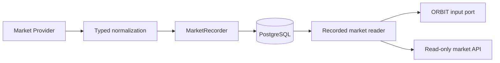

# Phase 1A — Market Recorder foundation

## Scope and boundaries

Phase 1A implements a real PostgreSQL recording and read path for normalized market observations. The only bundled provider is a deterministic in-memory fixture adapter. No external feed, HTTP/RPC transport, scheduler, LLM, or trading strategy is implemented here. There is no live-money execution. PAPER remains the only trading-capable mode; all existing SENTINEL checks and paper accounting are unchanged.



`src/markets/providers.py` defines discovery, snapshot retrieval, and price/liquidity/volume protocols. Provider-specific transport and normalization belong behind these ports, outside agents. `record_provider` performs one explicit discovery/retrieval/recording pass. It validates both discovery and snapshot provenance against the adapter's declared provider and fixture status. Discovery and returned snapshots must have the same immutable `MarketIdentity`: provider, chain, network, pair_id, base.asset_id, quote.asset_id, venue and is_fixture. Event UUIDs, observed_at and correlation IDs may legitimately differ between discovery metadata and a later snapshot. Nested provenance checks remain mandatory within each record. The recorder also accepts already normalized snapshots from trusted infrastructure.

Future adapters must parse monetary JSON numbers as Decimal at the transport boundary (for example, `json.loads(body, parse_float=Decimal)`) or accept decimal strings. They must supply stable event UUIDs for upstream replay, such as UUIDv5 derived from provider, chain, network, pair and upstream observation identity. Reusing an event UUID with changed content is an error. Generating a fresh UUID for every retry defeats deduplication. Provider credentials must come from Settings/environment when an adapter is added; none are needed or embedded here.

## Contracts and provenance

`src/markets/models.py` contains immutable `AssetIdentity`, `MarketPair`, `MarketSnapshot`, `PriceSnapshot`, `LiquiditySnapshot`, `VolumeSnapshot`, and `MarketCandidate` records. Each carries an observation UUID, timezone-aware `observed_at`, provider, chain, network, chain-qualified asset identity, correlation UUID, and explicit fixture marker. Pair identifiers use the same `chain:network:identifier` convention. A snapshot contains its pair/base/quote identities and price, liquidity and volume observations. Nested provider, chain/network, trace, fixture and asset identities must agree; quote assets are deliberately different from base assets. Nested observation timestamps cannot exceed their enclosing observation timestamp.

These ingestion models intentionally remain separate from the pre-existing `src/core/models.py` SENTINEL evidence models. Recorded price and liquidity data alone cannot prove token safety, routing safety, holder concentration, or accounting state. There is no automatic conversion into execution evidence and no route from the recorder to the executor.

Amounts use finite nonnegative Decimal values with NUMERIC(38,18)-compatible precision; available prices must be positive. Floats and booleans are rejected, including in nested fields. JSON encodes decimals as strings to retain exact precision. Every measurement exposes `AVAILABLE`, `UNKNOWN`, or `UNAVAILABLE`; absent values remain null. `AVAILABLE` requires a value, and the other statuses require null. Zero is only valid when explicitly observed, never a substitute for missing data.

## Persistence and replay

Alembic revision `0002` adds `market_observations`, separate from the trading-evidence table `market_snapshots`. Every row holds one normalized snapshot envelope with all component observations, schema version 1, provider and chain-qualified identity, event/trace UUIDs, provider observation time, trusted recording time, freshness metadata and JSONB payload. The payload contains normalized observations, not arbitrary provider response bodies. PostgreSQL is authoritative; no runtime file store is used.

A primary key on the event UUID plus `INSERT ... ON CONFLICT DO NOTHING` serializes duplicate ingestion. The recorder compares the existing normalized serialized payload within the transaction: identical replay succeeds without another row; different content or provenance raises `ObservationConflict`. Serialization preserves decimal scale and timestamp representation, so adapters must normalize these consistently across retries. Trusted recorded_at is assigned only to the first insertion; replay retains it and cannot promote an older event in the read ordering. Unrelated events do not lock the paper portfolio account.

The migration adds a PostgreSQL trigger rejecting UPDATE, DELETE and TRUNCATE. It protects against accidental mutations; database owners can still alter schema/disable triggers. Runtime identities must not be schema owners in a hardened deployment. Migration downgrade deliberately drops this table and its history; use it only on disposable databases or after an explicit backup/recovery decision.

Indexes cover provider/pair/time/event ordering, asset/time lookup and observation time. Records are appended without updating portfolio rows or maintaining expensive aggregates. Reads use a window query and bounded results, not an in-memory scan of all JSON payloads. Retention, partitioning, write batching, connection capacity and query plans require measurement at actual provider volume; no additional infrastructure or throughput claim is introduced.

## Latest data and freshness

The reader first ranks each complete provider/pair/fixture stream by **observed_at DESC -> recorded_at DESC -> UUID deterministic fallback** (`id DESC`). Provider observation time takes precedence; for equal observation times, trusted recorder time determines recency. UUID only resolves ties in both timestamps and never substitutes for recorder recency. After newest-event selection, visibility, identity, provider, chain/network, availability and freshness filters are applied. New UNKNOWN, unavailable, future-dated, stale-component or identity-inconsistent events cannot reveal an older matching event from the same stream. In particular, filtering for an old base asset never resurrects an earlier event after the latest event changes that identity. Provider and fixture streams remain isolated.

Freshness uses a trusted Clock at query time and is rechecked after the database read. `MARKET_MAX_AGE_SECONDS` defaults to 60 (allowed range 1–3600) for API reads. The snapshot envelope plus price, liquidity and volume timestamps must be within that interval and not in the future. Static asset/pair identity metadata may be older. Price and liquidity must be available; volume may be explicitly unknown. This means “usable recorded data,” never “safe to trade.” Known zero liquidity is still an observation, not a trading endorsement.

Old, future-dated and unknown observations remain durably recorded for audit but are not returned as valid current snapshots. `MarketCandidate` is a deterministic reference to a valid recorded snapshot with preserved provenance. It contains no opportunity score, recommendation or tradability assertion. Candidate references are derived at read time; the underlying snapshot is authoritative.

Fixtures are excluded by default. Explicit `include_fixtures=true` includes labeled fixture streams. An invalid latest fixture cannot suppress a non-fixture stream. `MarketRecorder.latest` exposes the default 60-second view; construct `MarketReader(max_age=...)` for a different trusted internal threshold.

## API and ORBIT

- `GET /api/markets`: latest valid snapshots; optional provider, chain, network and fixture filters.
- `GET /api/markets/{identity}`: exact chain-qualified asset or pair; the newest valid result across matching streams, or 404. The list endpoint exposes provider-specific results when several streams match.
- `GET /api/market-candidates`: candidate references derived from the same valid snapshot view.

Lists accept `limit` (1–100, default 50) and nonnegative `offset`; ordering is observed_at, recorded_at, then event UUID, all descending. Offsets do not promise stable pagination across concurrent new observations. Decimal values are JSON strings. Database failures return 503; valid empty lists remain 200. There are no market write endpoints. `/ready` requires schema revision `0002`.

`src/agents/orbit.py` defines `OrbitMarketInput` with only latest-snapshot and candidate reads. `MarketReader` implements that shape in trusted application infrastructure. Python protocols are not a security sandbox: future isolated agent workers must receive serialized records through a read-only service, not a reader instance holding a session factory. Agents receive no DB write credentials, provider transports, recorder, executor or signing capability. The API currently uses the configured runtime DB connection internally and exposes only reads; separate database read credentials and authenticated worker delivery remain deployment work.

## Fixture demonstration

From `backend/`, with root `.env` configured for native PostgreSQL and migrations applied:

```sh
uv run alembic upgrade head
uv run python - <<'PY'
import asyncio
from datetime import UTC, datetime
from uuid import uuid4

from src.core.config import Settings
from src.data.database import connect
from src.markets.fake import InMemoryProvider, fixture_snapshot
from src.markets.recorder import MarketRecorder, record_provider

async def main():
    engine, sessions = connect(Settings().database_url)
    try:
        observation = fixture_snapshot(datetime.now(UTC), uuid4())
        count = await record_provider(InMemoryProvider((observation,)), MarketRecorder(sessions))
        print(f"Recorded {count} explicitly labeled fixture observation(s)")
    finally:
        await engine.dispose()

asyncio.run(main())
PY
```

While the backend runs, query `http://127.0.0.1:8000/api/markets?include_fixtures=true` within the freshness window. The default list stays empty until non-fixture observations exist. The dashboard remains an explicitly labeled Phase 0 fixture preview; it is not connected to these endpoints and makes no new live-data claim.

## Verification

Tests exercise both the direct SQLite test engine and disposable native PostgreSQL schemas. PostgreSQL tests install the actual `0002` migration so concurrent idempotency and append-only trigger checks run against the real database. Full Alembic upgrade, schema drift, offline SQL and downgrade/re-upgrade are checked separately. Frontend typecheck, lint, formatting and production build remain required.

Local verification on 2026-09-10 used Python 3.13.2, native PostgreSQL 16.14, Node.js 22.22.2 and Next.js 16.3.4:

| Check | Result |
| --- | --- |
| Full PostgreSQL pytest suite | 197 passed; 96% statement coverage |
| SQLite pytest suite | 189 passed; 8 PostgreSQL-specific checks skipped |
| Locked backend dependency sync | Passed |
| Ruff lint and formatting | Passed, 48 Python files formatted |
| Strict mypy | Passed, 32 source files |
| Alembic upgrade and schema drift | Passed; no pending schema operations |
| Offline PostgreSQL SQL | Passed |
| Disposable downgrade to 0001 and re-upgrade | Passed |
| Documented fixture example and API-to-PostgreSQL reads | Passed, including default fixture exclusion and readiness |
| Frontend typecheck, lint and formatting | Passed |
| Next.js production build | Passed |

The final correctness pass adds ten regression cases: quote/venue/base identity changes are rejected; legitimate discovery-to-snapshot event metadata changes are accepted; later recorder time beats UUID for AVAILABLE/UNKNOWN transitions and cross-stream ordering; identity filters cannot resurrect older events; replay retains original recorded_at. Existing provider/fixture isolation and UUID fallback tests remain covered. Two local PostgreSQL runs aborted when the Coding volume ran out of space; removing regenerable frontend build and mypy caches allowed the complete suite to pass. The frontend build had passed before that cache cleanup. The isolated verification database was stopped and removed afterward. Existing paper execution, risk, accounting and configuration tests are included in these totals.

No external provider behavior, sustained ingestion throughput, hosted CI execution or complete production deployment is claimed by these local checks.
