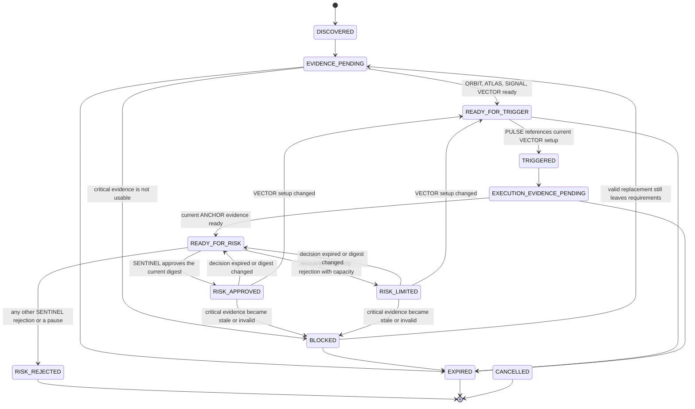

# Phase 2A: deterministic TradeCase workflow

Phase 2A adds the durable team workflow that future specialist workers must use. It does not run
LLMs, route trades, hold wallet material, sign transactions, broadcast transactions, or enable live
execution. PAPER remains the only trading-capable mode. SENTINEL and LEDGER remain deterministic
authoritative services.

## Lifecycle

`trade-case-v1` is a code-defined, versioned policy. The evaluator alone derives canonical case
state from the current immutable evidence set, trusted time, and an optional deterministic SENTINEL
decision.

`RISK_REJECTED`, `EXPIRED`, and `CANCELLED` are the only terminal states. `RISK_APPROVED` and
`RISK_LIMITED` are both **authorizations, not endings**: each is deliberately re-evaluable, because
an expired, superseded, stale or invalid safety input must be able to remove the authorization that
was granted from it. Making either terminal would freeze a live authorization against evidence that
has since changed, so both remain mutable enough for the evaluator to revoke them. No Phase 2A state
performs execution.

`RISK_REJECTED` is terminal for that TradeCase and cannot be reopened. COMMANDER cannot reopen it,
FUSE cannot override it, and no later evidence, task change or second SENTINEL decision moves it
back toward authorization. When conditions change materially enough to deserve reconsideration, the
correct action is to open a **new** TradeCase, which keeps the rejected case a clean audit record.

Callers cannot assign `TradeCase.status`. Domain contracts are frozen, public HTTP routes are
read-only, and internal commands lock the case before asking `TradeCaseEvaluator` for the next
state. Illegal transitions raise typed workflow errors. COMMANDER has no force-transition or blocker
override capability.

## Team tasks and evidence

Opening a case creates an idempotent durable task ledger for ORBIT, COMMANDER, ATLAS, SIGNAL,
VECTOR, FUSE, PULSE, and ANCHOR. Tasks distinguish required and optional work and use `PENDING`,
`RUNNING`, `SUCCEEDED`, `BLOCKED`, `FAILED`, `CANCELLED`, and `EXPIRED`. SENTINEL and LEDGER are
services rather than worker roles.

Evidence is an immutable envelope containing its case, expected producer role and type, schema
version, provenance, observation and recording times, explicit validity deadline, typed status,
reason codes, correlation ID, idempotency key, and optional supersession link. Phase 2A types are:

- `DISCOVERY_EVIDENCE`
- `ONCHAIN_EVIDENCE`
- `SENTIMENT_EVIDENCE`
- `TRADE_SETUP_EVIDENCE`
- `TRIGGER_EVIDENCE`
- `LIQUIDITY_EXECUTION_EVIDENCE`

Statuses are `AVAILABLE`, `UNKNOWN`, `UNAVAILABLE`, `INVALID`, and `STALE`. The trusted `Clock`
computes effective freshness: evidence is stale at `now >= valid_until`, and a future observation is
invalid. Tests use `FixedClock`; application paths do not call wall-clock time directly.

The central policy marks ATLAS on-chain integrity, VECTOR setup, PULSE trigger, and ANCHOR execution
evidence as safety-critical. Any non-available effective status blocks. FUSE can obtain only fresh,
case-bound evidence from each expected producer and cannot transform an UNKNOWN value into
AVAILABLE. Structured blockers identify the role, evidence type, evidence ID, and safe reason code.

VECTOR setup evidence has a stable evidence ID. A PULSE trigger names that exact ID, and ANCHOR
names both the current setup and trigger. Superseding VECTOR therefore makes the old trigger and
ANCHOR assessment unusable. Available ANCHOR evidence requires quote, liquidity, slippage, price
impact, maximum safe size, routing provenance, and a validity deadline. Phase 2A records those
values; it does not discover or execute a route.

## SENTINEL binding

The existing Phase 0 `RiskDecision` remains the deterministic SENTINEL result, and Phase 0
`RiskOutcome` is unchanged: `APPROVE`, `REJECT`, `PAUSE_SYSTEM`. Phase 2A does **not** add a SENTINEL
"LIMIT" verdict. Instead `src/risk/authorization.py` holds the one authoritative interpretation of a
final decision, `RiskAuthorization`, with three values:

| RiskAuthorization | TradeCase state | Meaning |
| --- | --- | --- |
| `APPROVED` | `RISK_APPROVED` | The requested trade is authorized within the decision's own deterministic limits, subject to revalidation. |
| `LIMITED` | `RISK_LIMITED` | The requested size was **rejected**, but the decision carries a bounded safe capacity under which a resized request may be reconsidered. |
| `REJECTED` | `RISK_REJECTED` | No authorization exists. |

`LIMITED` never rewrites history into an approval. A Phase 0 `REJECT` means the originally requested
intent was rejected, and that stays recorded verbatim on the binding. `LIMITED` states only the
narrower fact that the rejection was exclusively a *resizable sizing* rejection.

### Resizable sizing-only rejection

`classify_risk_authorization` returns `LIMITED` only when every one of these holds:

1. the outcome is exactly `REJECT`;
2. the reason codes are non-empty and **every** code is in `RESIZABLE_SIZING_REASON_CODES`, namely
   `INSUFFICIENT_CASH`, `MAX_EXPOSURE` and `MAX_POSITION_SIZE` — the only Phase 0 codes that describe
   a purely arithmetic budget shortfall against the requested BUY size;
3. `max_additional_notional_usd` is strictly positive;
4. `position_size_limit_usd` is strictly positive, so a resized request has an enforceable ceiling.

Everything else fails closed to `REJECTED`, including: a pause, an unrecognised or future reason
code, any safety, freshness, integrity, mode, accounting, holder, liquidity, slippage or fee code
sitting beside a sizing code, the SELL-side `INSUFFICIENT_POSITION` shortfall, zero capacity, and any
`RiskOutcome` value added in future. `PAUSE_SYSTEM` maps to `REJECTED` unconditionally: no amount of
positive sizing data in the payload can soften a system pause. The classifier is a pure Decimal
function with no clock, no I/O and no float arithmetic, and the workflow engine calls it rather than
re-deriving the rule in its own branches.

### Digest and binding

The evaluator computes a canonical SHA-256 `risk_input_digest` over the TradeCase ID, the workflow
version, and one explicit entry per active safety-critical input holding its evidence type, producer
role, evidence ID, schema version and immutable submission fingerprint. Entries are built as
explicit tuples, totally ordered by a stable key, and serialized as sorted-key JSON with fixed
separators, so no database row order, dict insertion order, set iteration order or arrival order can
reach the hash.

Only the four policy safety-critical types participate: ATLAS on-chain, VECTOR setup, PULSE trigger
and ANCHOR execution evidence. `DISCOVERY_EVIDENCE` and `SENTIMENT_EVIDENCE` deliberately do not.
They still gate the workflow — a stale or unknown one produces a required-evidence blocker that moves
the case out of any authorized state through the evaluator — but they are not part of the risk
snapshot, so a sentiment refresh does not invalidate a binding that never depended on it.

Selecting the active evidence is likewise order-independent. Each evidence type holds a single
supersession chain, so two simultaneously active envelopes of one type mean stored history is
inconsistent; that is never resolved by retrieval order and raises `EVIDENCE_INTEGRITY` instead.

A decision is accepted only for a `READY_FOR_RISK` case, its current digest and correlation ID, and
its own validity interval. The binding persists every restriction a future execution boundary must
honour in its own typed column — the original `RiskOutcome`, the derived `RiskAuthorization`, the
reason codes, `position_size_limit_usd`, `max_additional_notional_usd`, `max_slippage_bps`, the
evaluation and expiry instants, the digest, and the TradeCase, decision and correlation identities.
Money is `NUMERIC(38, 18)` with `CHECK` bounds and no float anywhere. The full decision JSON is kept
alongside as audit provenance only; enforcement never parses it. The evaluator re-derives the
authorization from those typed values rather than trusting the stored label, and the domain model
rejects a binding whose stored classification does not follow from its own decision values.

`position_size_limit_usd` and `max_additional_notional_usd` are **not** synonyms and are never
collapsed into one number. The first is the absolute configured maximum position size; the second is
the conservative maximum additional BUY quote notional. A future execution boundary must enforce both
simultaneously, each under its own meaning.

Changing or expiring any relevant evidence changes the derived state or the digest, so an older
authorization cannot cover later evidence. This applies identically to `RISK_APPROVED` and
`RISK_LIMITED`: a stale or superseded ANCHOR assessment, a superseded VECTOR setup, an invalidated
PULSE trigger, an unknown ATLAS assessment, a changed digest, or a lapsed decision validity window
all revoke the authorization. Revocation returns the case to the prerequisite the changed evidence
actually invalidated — `BLOCKED`, `READY_FOR_TRIGGER`, `EXECUTION_EVIDENCE_PENDING` or
`READY_FOR_RISK` — never a hardcoded state. Replaying an expired decision re-evaluates under the same
row lock and cannot resurrect the authorization. A rejection cannot be overridden through the
workflow service.

### Deferred execution-binding invariant

Phase 2A has no executable `TradeIntent`, so a bound `RiskDecision` is currently tied to the
TradeCase by case identity, correlation ID and risk-input digest, while its own `intent_id`,
`market_snapshot_id` and fingerprints reference a Phase 0 intent that the workflow does not yet
model. That is sufficient here only because no execution path, order object or external mutation
route exists.

**Hard requirement for the phase that introduces trade intents or executor-facing requests:** a risk
decision used for execution must be deterministically bound to the exact execution intent, covering
at least the TradeCase ID, the `MarketIdentity`, the side, the requested notional or quantity, the
VECTOR setup identity and version, the relevant route or quote identity, and the `risk_input_digest`.
No future executor may consume a risk decision merely because a correlation ID matches.

## Persistence, concurrency, and idempotency

Migration `0005` creates:

- `trade_cases`, the locked current projection with a monotonic revision;
- `trade_case_tasks`, the durable assignment ledger;
- `trade_case_evidence`, immutable typed submissions;
- `trade_case_risk_bindings`, immutable revisions of SENTINEL decisions with typed limit columns;
- `trade_case_transitions`, immutable state history;
- `trade_case_events`, the ordered authoritative timeline.

PostgreSQL is authoritative. Evidence, risk bindings, transitions, and timeline events have database
triggers that reject updates, deletes, and truncation. Each command uses `SELECT ... FOR UPDATE` on
the case. Unique keys protect case opens, task attempts, evidence submissions, risk decisions, and
case revisions. Optional expected revisions reject stale callers. Python locks are not part of the
consistency model.

Logical replay returns the existing case or evidence. Reusing an idempotency identity with different
content fails. Evidence replacement must point to the current envelope. Evaluation replay does not
append duplicate transitions. The sequence-backed event stream records case opening, task changes,
evidence recording and supersession, blocker changes, transitions, risk binding, expiry, and
cancellation.

## Interfaces and capabilities

The public API exposes observability only:

- `GET /api/trade-cases`
- `GET /api/trade-cases/{id}`
- `GET /api/trade-cases/{id}/timeline`
- `GET /api/trade-cases/{id}/evidence`
- `GET /api/trade-cases/{id}/tasks`

The list supports status, chain, canonical market ID, and update-time filters. There are no public
mutation routes.

Future trusted coordinators and workers must use the typed `TradeCaseService` commands to open a
case, create tasks, submit evidence, evaluate, bind SENTINEL output, expire, or cancel. Specialist
workers may eventually read approved source data and submit only their typed evidence. They must not
receive arbitrary authoritative database writes, RPC writes, signer or executor access, status
setters, or SENTINEL overrides.

Phase 2A does not implement any ORBIT, ATLAS, SIGNAL, VECTOR, PULSE, ANCHOR, FUSE, or COMMANDER
reasoning worker. It also reserves execution and position lifecycle for a later phase.
