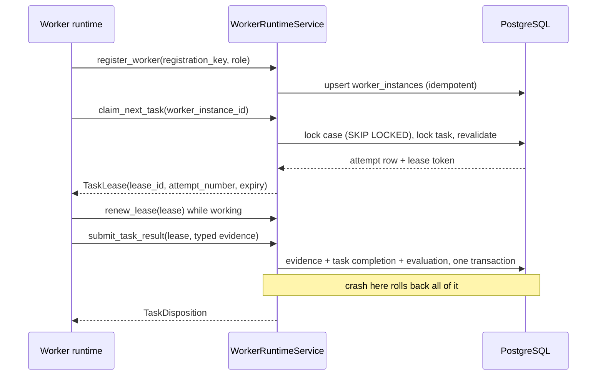

# Phase 2B: capability-restricted worker runtime

Phase 2B provides execution control for specialist workers, not strategy authority.
Workers can produce typed evidence only within their role-scoped capabilities.
TradeCase transitions remain deterministic, SENTINEL remains non-overridable, and
no worker can execute trades.

No reasoning worker exists yet. No model provider, prompt, API key, social source
or on-chain vendor is added. Phase 2B ends with deterministic fake workers in
tests, and the runtime is disabled by default.

## Trust model

Future LLM workers are untrusted from an authorization perspective. They are
reasoning components, and safety never rests on a prompt asking them to behave.
A worker never receives a database session, connection or credential, a raw RPC
or HTTP client, a provider SDK, a signer, wallet or private key, an executor, a
ledger write, a SENTINEL mutation, a TradeCase status setter or a force
transition. The process may have network access; the worker abstraction never
hands it over.

## Execution model

Processing is **at-least-once**. A worker may run the same logical task again
after a crash, a lost process, a lost network, an expired lease or an ambiguous
acknowledgement. Nothing here claims exactly-once execution, which is not an
achievable guarantee across a process boundary.

Duplicate execution never produces duplicate authoritative effects, because four
mechanisms combine:

- a database-enforced **single active lease** per task,
- **durable idempotency** on every result,
- **immutable attempt history**, and
- **idempotent evidence submission** reusing the Phase 2A boundary.

## Worker identity

`worker_instance_id` identifies **one runtime lifetime**, not a role and not a
deployment slot. A `registration_key` is the idempotency token for exactly one
runtime start, minted freshly by `new_registration_key()` when a runner is
constructed, and `worker_instance_id` is derived from it deterministically so a
retried registration call resolves to the same instance.

The distinction is deliberate and matters for audit:

| Concept | Example | Stable across restarts |
| --- | --- | --- |
| Role | `ATLAS` | yes |
| Runtime instance | the process that started at 10:00 | **no** |

An ATLAS process that starts at 10:00 and crashes at 10:12 and its replacement
starting at 10:13 are two `worker_instance_id` values, because the replacement
mints a new registration key. They must not collapse into one identity merely
because the role and runtime version are unchanged, or attempt history could no
longer say which process abandoned a lease.

Deriving the key from a role, host, deployment name or runtime version would
produce exactly that collapse and is therefore never done. Registration stays
idempotent for the retries of a single start; the same key with a different role
or version is a `WORKER_IDENTITY_CONFLICT`.

`worker_instance_id` is not a secret and grants nothing on its own. Authority
always requires the exact active combination of trade case, task, owning
`worker_instance_id` and `lease_id`, where `lease_id` is a fresh random UUID4 per
attempt and is never derived from the task, worker, role or attempt number.

## Leases

A claim takes exclusive, time-bounded authority over exactly one attempt and
returns an unguessable `lease_id`. Every worker-side mutation requires the lease,
the task, the trade case and the owning worker instance together. A role or a
task id alone authorizes nothing, so a worker whose lease expired cannot submit
afterwards even with a perfectly well-formed payload.

Current lease state lives on `trade_case_tasks` rather than in a separate lease
table. That is the deliberate choice: one row owns at most one `lease_id`, so
"at most one active lease per task" holds *by construction* instead of needing a
partial unique index, and claiming is a single locked row update rather than two
writes that could disagree.

Leases expire. Heartbeats extend only the caller's own active lease, within a
renewal budget and never past a hard task deadline, so a stuck worker cannot hold
work forever. A heartbeat updates current task state and never writes attempt
history, which is why that history is genuinely immutable once finished rather
than merely labelled so.

## Attempts

`worker_task_attempts` is written once on claim and exactly once more when the
attempt finishes. A row-level trigger then rejects any further update, and a
statement-level trigger rejects deletes and truncation. Outcomes are `SUCCEEDED`,
`FAILED_RETRYABLE`, `FAILED_PERMANENT`, `LEASE_EXPIRED`, `CANCELLED` and
`SUPERSEDED`. Attempt numbers are monotonic per task and unique in the database.
No attempt is ever deleted, and private model reasoning is never persisted: the
record holds identities, timings, typed outcomes and safe reason codes only.

## Capability matrix

The role-to-evidence matrix is *derived* from the Phase 2A workflow policy rather
than restated, so a capability cannot drift from the requirement it serves.

| Role | Read port | May submit |
| --- | --- | --- |
| ORBIT | recorded market observations | `DISCOVERY_EVIDENCE` |
| ATLAS | approved on-chain intelligence (later phase) | `ONCHAIN_EVIDENCE` |
| SIGNAL | approved sentiment source (later phase) | `SENTIMENT_EVIDENCE` |
| VECTOR | stored market history (later phase) | `TRADE_SETUP_EVIDENCE` |
| PULSE | current setup plus permitted realtime feed | `TRIGGER_EVIDENCE` |
| ANCHOR | liquidity and routing reads | `LIQUIDITY_EXECUTION_EVIDENCE` |
| FUSE | current, fresh, role-bound evidence | nothing |
| COMMANDER | TradeCase state, deterministic evaluation requests | nothing |

SENTINEL, LEDGER and EXECUTOR are absent from `AgentRole` entirely, so they are
structurally incapable of being registered, claimed or handed capabilities.

Capabilities are composed per role. There is no object on which every method
exists, so a worker cannot reach a capability it was not given. FUSE holds a
read-only port and may not restate evidence as its own, clear a blocker or turn
an UNKNOWN into an AVAILABLE. COMMANDER may ask the deterministic evaluator to
recompute state but cannot choose the result, set a status or file evidence on
another role's behalf.

Ports that a later phase owns are simply absent rather than stubbed. A role whose
port is not configured cannot run at all, which is honest about what exists
instead of handing a worker something that quietly returns nothing.

## Server-side authorization

Capability objects are convenience, not security. Every submission is
independently re-verified in the service: an active task and lease, ownership by
the calling instance, matching role and task, an evidence type permitted for that
role, the right trade case, a workable case, references that are still current,
and a valid idempotency identity. The runtime, not the worker, owns the evidence
idempotency key, so a worker cannot address another task's evidence slot.

Refusals are typed (`ROLE_NOT_AUTHORIZED`, `EVIDENCE_TYPE_NOT_AUTHORIZED`,
`LEASE_EXPIRED`, `TASK_SUPERSEDED`, …) and never carry provider detail or
secrets. A capability violation is recorded as a permanent failure with an audit
event rather than silently returning false.

## Result atomicity

`submit_task_result` records evidence, completes the task, finalises the attempt
and runs the deterministic evaluation in one transaction, reusing the Phase 2A
boundary rather than restating any workflow rule. A crash between evidence
insertion and commit rolls back all of it: no evidence, no completed task, no
successful attempt, and the retry is safe. A task is never marked successful
before its evidence exists.

## Retry, backoff and poison tasks

Failure categories are typed and the policy, not the worker, decides what they
mean: `TRANSIENT`, `INVALID_RESULT` and `INTERNAL` retry within a budget;
`CAPABILITY_DENIED` is permanent; `TASK_INVALIDATED` supersedes the attempt
because the work no longer applies. Backoff is deterministic, bounded and stored
as `next_eligible_at`, so a restart preserves the schedule and no correctness
depends on a process sleeping. When the attempt budget is exhausted the task ends
at `FAILED` with `TASK_RETRY_EXHAUSTED`; the workflow then continues to see the
missing required evidence as a blocker. Nothing loops forever and nothing is
silently abandoned.

## Concurrency

Lock ordering is always TradeCase first, then task, matching the Phase 2A command
services, so worker claims cannot deadlock against workflow commands. Claim
candidates are read without a lock and then confirmed under that order and
revalidated, with `SELECT ... FOR UPDATE SKIP LOCKED` on the case so independent
workers proceed in parallel while two claimers of one case serialize. Every
revalidating read uses `populate_existing`, because a session that already saw a
row unlocked would otherwise revalidate stale attribute values after taking the
lock.

PostgreSQL is authoritative. SQLite cannot reproduce `SKIP LOCKED` or the
append-only triggers, and those tests skip there.

Tested races: two claimers of one task, parallel claims across cases, heartbeat
against reclaim in both directions, duplicate result submission, cancellation
against submission, setup supersession against a trigger result, concurrent
failure reports, and concurrent registration.

## Recovery

`recover_expired_leases` performs bounded sweeps and is safe from many processes.
No always-running background thread is required inside the domain model. An
abandoned lease becomes a finished `LEASE_EXPIRED` attempt, the task returns to
the queue under its retry policy, and the next attempt number increments
deterministically. Previous attempts are never deleted, and no manual database
intervention is needed.

On cancellation the runtime writes no outcome at all and lets the lease expire,
rather than recording a false result on the way out. On shutdown a runtime stops
claiming and leaves in-flight leases to expire; a hard kill needs no cleanup
write to stay correct.

## Persistence

Migration `0006` adds:

- `worker_instances`, the registered runtime instances;
- `worker_task_attempts`, immutable-once-finished attempt history;
- current lease and retry-scheduling columns on `trade_case_tasks`.

Constraints carry the invariants: unique `(task_id, attempt_number)`, unique
`lease_id`, positive attempt numbers, a lease window that must end after it
starts, an all-or-nothing lease pairing, an outcome that exists exactly when the
attempt is finished, and one task row per `(trade_case_id, role, task_type)` slot.
Indexes cover the claim filter, lease-expiry recovery and attempt lookups, and
nothing speculative beyond that. Migrations `0001`-`0005` are untouched.

## Interfaces

Read-only observability: `GET /api/worker-runtime`, `GET /api/workers`,
`GET /api/workers/{id}`, `GET /api/worker-attempts`. There is deliberately **no**
public claim, heartbeat, complete or fail route, because the authentication and
identity model for external worker processes has not been designed. Every
mutation stays an internal application capability.

`/api/worker-runtime` reports configuration and states plainly that no reasoning
worker is implemented. Nothing reports an agent as online, and the dashboard is
unchanged.

## Configuration

`WORKER_RUNTIME_ENABLED` defaults to `false`, alongside `WORKER_LEASE_SECONDS`,
`WORKER_MAX_ATTEMPTS` and `WORKER_POLL_INTERVAL_SECONDS`. Booting the API never
starts a worker host, and enabling the flag alone starts nothing, because no
reasoning worker exists to run.

## What Phase 2B does not implement

No specialist reasoning, no model provider or prompt, no generic
`call_tool(name, arbitrary_json)` mechanism, no executor, signer, wallet or
broadcast path, no ledger write, no autonomous risk evaluation and no dashboard
change. A worker result is never a free-form "BUY" or "SELL" recommendation: it
is typed evidence, and the deterministic workflow alone decides what it means.

The next phase introduces specialist workers one at a time on top of this
substrate, starting from the capability ports listed above.
